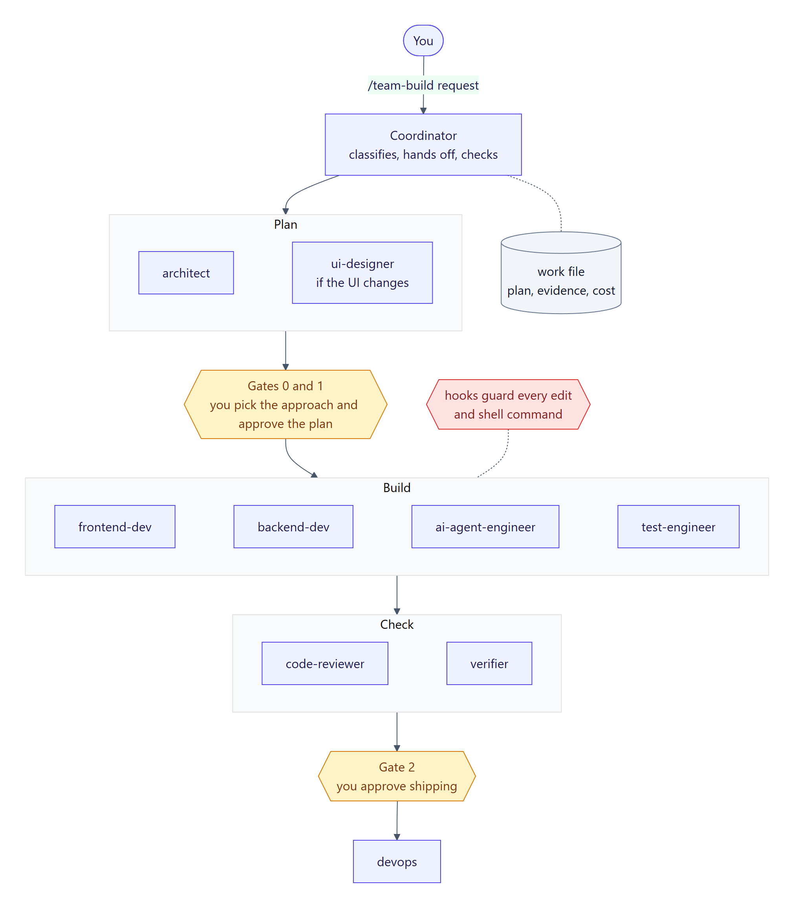

# claude-skills

A Claude Code setup that turns one session into a small software team. You type `/team-build <what you want>`, and the main session coordinates nine specialist subagents: an architect, a designer, three builders, a test engineer, a code reviewer, a verifier and a devops engineer. Every step is checked against written acceptance criteria. The team stops for your approval before it builds, and again before anything ships.

**Windows only for now:** the hooks and scripts are PowerShell. New to the terms? See the [glossary](docs/glossary.md).

<picture>
  <source media="(prefers-color-scheme: dark)" srcset="docs/images/overview-dark.png">
  
</picture>

## Is it for you?

It suits work where being right matters more than being fast. Each step is planned, tested, reviewed and independently verified, and you approve the plan before anything is built. That costs far more tokens than doing the work in one session.

| | Measured on a small test project |
|---|---|
| Small change or bug fix | 6–15 subagent calls, 0.4–1.4 million tokens, roughly 10 minutes to an hour |
| First slice of a spec build (web page + AI summary + MCP tool) | 33 calls, about 4.4 million tokens |

The tokens count against your Claude plan's usage limits, or your API bill if you use an API key. Each run records what every step cost, so you can see where the tokens went.

**Not yet proven:** the setup was tested with eight runs on one small Node.js project. In those runs:
- the deploy step never ran for real;
- a person never answered the gates live (they were answered ahead of time);
- live AI evals were never paid for, so AI features were only checked against recorded replies.

Treat deploying through the team as experimental for now. [Lessons learned](docs/lessons-learned.md) has the details.

## What you get

| Part | What it does | Where |
|---|---|---|
| `/team-build` | The coordinator. It classifies the work, runs the right flow, hands work between personas, checks every step, keeps a record, and asks you at the gates. | `skills/team-build/SKILL.md` |
| 9 personas | Claude Code subagents, each with its own job, files, skills and report format | `agents/` |
| Checklists | The review checklist, AI-feature standards, MCP and ship checklists, and a QA guide | `skills/team-build/references/` |
| Scripts | Secret scan, evidence fingerprint, and the "tests must pass" gate | `skills/team-build/scripts/` |
| 4 hooks | Enforce rules that instructions alone can't: file ownership, risky commands, tests must pass, resuming a run | `hooks/` |
| Custom skills | `/freeze` (limit edits to some folders) and `playwright-testing` | `skills/` |
| Third-party skills | About 360 skills from other repos, pinned in a lock file. The team uses about 70 of them; the rest are general-purpose skills you can use yourself. | `skills-lock.json` |
| Installer | Installs everything and merges your settings. Safe to re-run. | `restore.ps1` |

## Install

**You need:** Windows, [Claude Code](https://docs.claude.com/en/docs/claude-code), Git (with Git Bash) and Node.js. Windows PowerShell 5.1, which ships with Windows, is enough.

**Back up `~/.claude` first** if you already use Claude Code. The installer changes global settings and overwrites files with the same names (see [What the installer changes](#what-the-installer-changes)):

```powershell
Copy-Item -Recurse "$HOME\.claude" "$HOME\.claude-backup"
```

Then:

```powershell
git clone https://github.com/suryas91/claude-skills
cd claude-skills
powershell -NoProfile -ExecutionPolicy Bypass -File .\restore.ps1
```

`-ExecutionPolicy Bypass` is needed because Windows blocks local scripts by default. The installer ends by running the hook tests, which should end with `FAILURES: 0`. Start a new Claude Code session afterwards.

## Your first run

Open a project that uses Git and type:

```
/team-build add a dark-mode toggle to the settings page
```

The team:
1. classifies the work (feature, change, bug fix, refactor or spec build) and sizes it;
2. writes a plan with numbered acceptance criteria (ACs);
3. stops for your approval: Gate 1. It's skipped only for small bug fixes;
4. builds, tests, reviews and verifies, fixing what the checks find;
5. stops again, at Gate 2, before anything is pushed or deployed.

**What it changes in your project:**
- All commits go on a new branch, `team/<slug>`, where the slug is a short name for the work (for example `team/dark-mode-toggle`). Nothing goes on `main`.
- It adds a `## Project commands` section to your `CLAUDE.md`, and adds a few entries to `.gitignore`. If the folder isn't a Git repo yet, it runs `git init` first.
- It keeps a record of the run in `docs/work/<slug>.md`, and per-persona notes in `.claude/agent-memory/`. Both are committed on the branch.

[Files a run creates](docs/how-it-works.md#files-a-run-creates-in-your-project) has the full list.

**To stop a run,** press `Esc` at any time. Nothing is pushed or deployed without your yes. Next time you run `/team-build` in that project, it finds the unfinished run and asks whether to **resume** or **abandon** it. Abandoning stops anything the run started and removes its state files. The branch and its commits stay; delete the branch if you don't want them.

## The five kinds of work

| Work type | Example | What's special |
|---|---|---|
| Feature | `/team-build add a chat assistant` | For medium and large features, the architect first proposes 2–3 approaches and you pick one (Gate 0). |
| Change | `/team-build make search also match tags` | Tests are updated to the new behavior first, and shown to fail, before the code changes. |
| Bug fix | `/team-build bug: pasted text shows too few words` | The bug is reproduced as a failing test, and its root cause confirmed, before anyone fixes it. |
| Refactor | `/team-build split server.js into modules` | The same tests must pass before and after, and none may be removed or weakened. |
| Spec build | `/team-build build the MVP in docs/prd.md` | The spec is planned as thin slices. Slice 1 is built and shown to you before the rest. |

## What the installer changes

Everything goes into your user-level `~/.claude`, so it applies to **every** Claude Code session and project.

| Change | Details |
|---|---|
| Skills | About 360 third-party skills in `~/.claude/skills`, plus this repo's `team-build`, `freeze` and `playwright-testing`. Those three folders are replaced on every run. |
| Personas | The 9 files in `~/.claude/agents/`. Files with the same names are overwritten. |
| Hooks | 4 PowerShell hooks in `~/.claude/hooks`, wired into `settings.json` |
| Permission mode | **If you haven't chosen a permission mode**, it's set to `auto`: Claude runs most tools without asking you each time, and a safety classifier still blocks risky actions. To keep being asked, set `permissions.defaultMode` in `~/.claude/settings.json` before you install. |
| Skill list | So the ~360 skills don't crowd every session's context, each is listed by name only in the main skill list (the author measured about 28k tokens down to about 2k). Personas still load their skills in full. Six `orch-*` skills that conflict with `/team-build` are turned off. Settings you already have for a skill are kept. |
| Plugins | The Playwright MCP server (lets personas drive a browser) and the Impeccable design plugin |

`settings.json` is merged, never replaced: your other settings stay as they are.

**What you'll notice day to day, in every project:**
- **Risky commands:** `careful.ps1` checks every shell command. It blocks a few dangerous ones outright, such as killing processes by name or deleting your home folder. It asks you first before others, such as `git reset --hard`, `git clean -f`, recursive deletes, force pushes, or printing a secret like `cat .env`.
- **UI edits:** the Impeccable design hook reviews UI file edits at the end of each turn.
- **Everything else:** the other three hooks do nothing unless a `/team-build` run or a `/freeze` is active.

See [Safety and evidence](docs/safety-and-evidence.md#the-four-hooks) for exactly what each hook does, and how to turn one off.

## Undo

**Restore your backup:**

```powershell
Remove-Item -Recurse -Force "$HOME\.claude"
Copy-Item -Recurse "$HOME\.claude-backup" "$HOME\.claude"
```

**Or remove the pieces by hand:**
1. Delete the 9 persona files from `~/.claude/agents/`.
2. Delete `~/.claude/skills/{team-build,freeze,playwright-testing}` and `~/.claude/hooks/`.
3. Remove the four hook entries under `hooks` in `~/.claude/settings.json`.
4. Run `claude plugin uninstall impeccable@impeccable` and `claude mcp remove playwright -s user`.

The third-party skills are ordinary skill folders in `~/.claude/skills`. Delete the ones you don't want.

## Documentation

| Page | Read it to learn |
|---|---|
| [How it works](docs/how-it-works.md) | The moving parts and how one run fits together |
| [Flows and gates](docs/flows.md) | Each kind of work step by step, the gates, the checks and the review |
| [The personas](docs/personas.md) | What each persona does, which files it may touch, and what it reports |
| [Safety and evidence](docs/safety-and-evidence.md) | Why a "PASS" can be trusted, and what the four hooks enforce |
| [The work file](docs/work-file.md) | The record each run keeps, with a real example |
| [Lessons learned](docs/lessons-learned.md) | What eight test runs found, and how the setup changed because of it |
| [Troubleshooting](docs/troubleshooting.md) | Common problems and fixes |
| [Glossary](docs/glossary.md) | AC, gate, lens, fingerprint and the other terms used here |

You can also use one persona on its own, without the full flow. See [Calling one persona directly](docs/personas.md#calling-one-persona-directly).

## Updating

```powershell
git pull
powershell -NoProfile -ExecutionPolicy Bypass -File .\restore.ps1 -SkipDownloads
```

`-SkipDownloads` updates the team files, hooks and settings without downloading skills (no network needed). To update the third-party skills, run the installer without it. To change the setup itself, see [CONTRIBUTING.md](CONTRIBUTING.md).

## Credits

The checklists, hooks and several process ideas are adapted from [gstack](https://github.com/garrytan/gstack), [ruflo](https://github.com/ruvnet/ruflo) and [claude-skills (alirezarezvani)](https://github.com/alirezarezvani/claude-skills), all MIT-licensed. [NOTICE.md](skills/team-build/references/NOTICE.md) records exactly what came from where.
