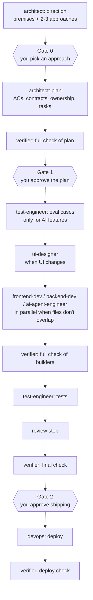
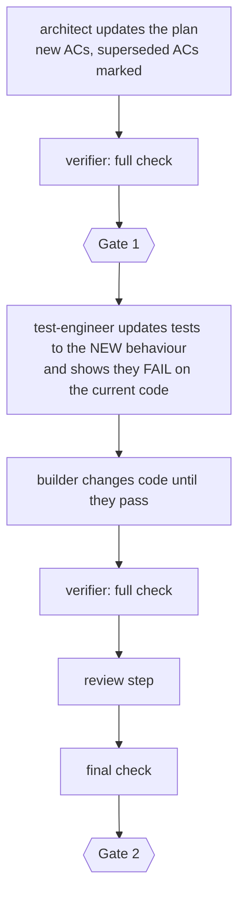
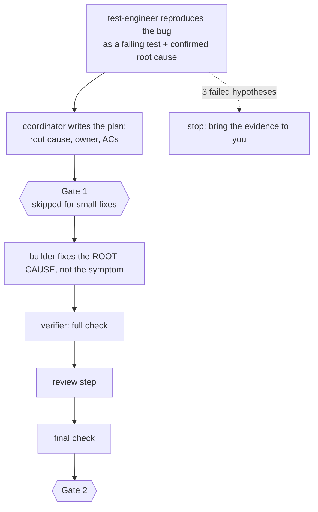
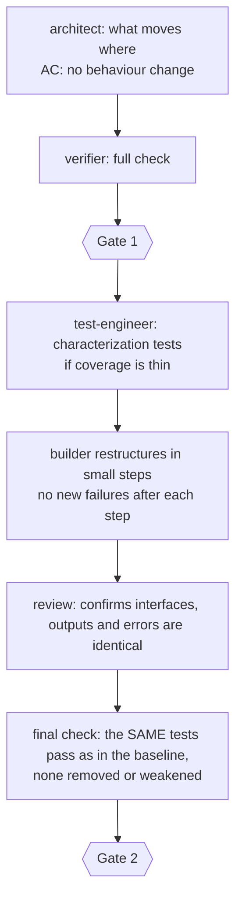
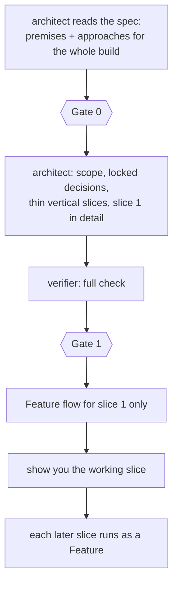
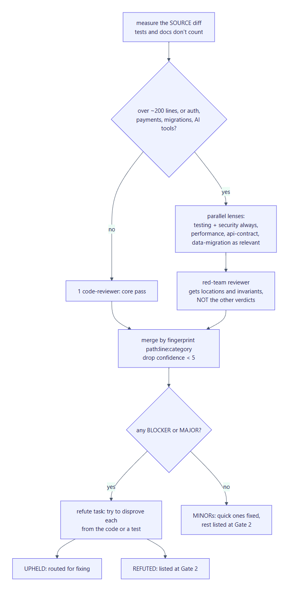
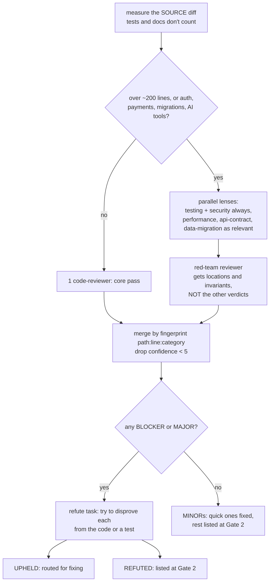

# Flows and gates

`/team-build` first **classifies** the request into one of five work types, then **sizes** it, then runs that type's flow. Every flow ends the same way: review, final check, then Gate 2. The authoritative text is [`SKILL.md`](../skills/team-build/SKILL.md); this page explains it.

**Contents:**
- [Preflight](#preflight)
- [The five flows](#the-five-flows)
- [The user gates](#the-user-gates)
- [The checks](#the-checks)
- [The review step](#the-review-step)
- [Failures and fix rounds](#failures-and-fix-rounds)
- [Finish](#finish)

## Preflight

Before any persona runs, the coordinator:

1. **Checks for an unfinished run.** If one exists, it shows you the Handoff and asks whether to **resume** or **abandon**. A leftover `.claude/team/ownership.json` or `verify-gate.json` counts, and so does a work file whose Status isn't `done` on a matching branch.
2. **Sets up git.**
   - Starts a repo if there isn't one.
   - If you have uncommitted files, it asks whether to commit them. If you say no, they're recorded as **user-owned** and never touched.
   - Creates the branch `team/<slug>`.
3. **Checks `CLAUDE.md`.** It needs a `## Project commands` section (install, dev, build, typecheck, lint, unit test, e2e) and a `## Stack` section. The coordinator checks each command against `package.json` or `pyproject.toml` and fixes anything stale.
4. **Checks `.gitignore`.** It must cover `.env*` (except `.env.example`), `.playwright-mcp/` and `.claude/team/`. The team never reads `.env` contents.
5. **Classifies and sizes** the work. Both are recorded, with reasons, in the work file's Decisions.
6. **Records a baseline.** The verifier runs the test suite at the start commit. Tests that already fail are recorded by name, so they're never blamed on the run and never hidden as "green".

## The five flows

*G0, G1 and G2 are your approval gates (amber). G1\* is skipped for small bug fixes. Every flow ends with the same review, final check and Gate 2.*

### Feature (a capability that doesn't exist yet)

Small features skip the direction stage and Gate 0. Large features get an extra full check after the first end-to-end slice works.

### Change (it works, but you want different behaviour)

Writing tests first proves the tests really describe the change. A test that passes before the code changes proves nothing.

### Bug fix (something is broken)

test-engineer follows strict debugging rules:
- **Hypotheses:** it states one hypothesis at a time and confirms it before any fix.
- **Three strikes:** after 3 failed hypotheses it reports BLOCKED instead of guessing.
- **Blast radius:** a fix that would touch more than 5 files needs your OK first.

### Refactor (better structure, identical behaviour)

In a refactor, test files may only gain characterization tests or follow a moved symbol. What a test asserts never changes.

### Spec build (a spec or PRD to build from)

## The user gates

The team stops and asks you at up to three points. Nothing is pushed, merged or deployed without your explicit yes in the conversation.

| Gate | When | What you see | What you decide |
|---|---|---|---|
| **Gate 0** | After the architect's direction (medium and large Features, spec builds) | 3–5 premises and 2–3 approaches with effort, risk, pros and cons, plus a recommendation. When the call is close, a four-voice [council](https://github.com/affaan-m/ecc) verdict is shown too. | Confirm or correct each premise; pick an approach |
| **Gate 1** | After the plan passes the verifier's full check | The goal, every acceptance criterion (including numbers for speed, accessibility and cost), the key contracts, file ownership, failure-mode gaps, the baseline's pre-existing failures and open questions | Approve, or send it back |
| **Gate 2** | After the final check, before devops | Every AC with its evidence, new vs pre-existing failures, the fingerprint match, the plan-completion list, open and refuted findings, and the rollback plan. Each "needs your confirmation" item (DNS, OAuth, dashboards) is listed separately. | Yes or no on each item, then whether to deploy |

**Ship checklist before Gate 2:** if you may deploy and the project has never been deployed to production, devops first makes a **read-only** pass of [`ship-checklist.md`](../skills/team-build/references/ship-checklist.md) over the whole repo. The same happens when the change touches auth, model-calling endpoints or deploy config. CRITICAL and HIGH results are fixed before Gate 2, and each manual item (backup restore tested, rollback written down, and so on) is put to you separately.

**Paid evals:** a persona that needs a live model eval costing more than the threshold in CLAUDE.md (USD 2 by default) stops and reports the estimate. The coordinator asks you first.

## The checks

| Check | Who | When | What it proves |
|---|---|---|---|
| **Baseline** | verifier | Before any code changes | Which tests already fail, by name |
| **Quick check** | coordinator | After every persona | Only that persona's files changed, the report matches the diff, the build passes, no stray processes, the secret scan is clean |
| **Full check** | verifier | After the plan, and after the builders | Plan: every requirement has a testable AC, contracts are complete, ownership doesn't overlap. Builders: each AC is demonstrated by running the app, calling the endpoint or driving the browser. |
| **Spot-check** | code-reviewer | After a review fix round | Each finding is resolved, and the fix added nothing new |
| **Final check** | verifier | Before Gate 2 | Every AC, the suite against the baseline, a weakened-bar scan, leftover scaffolding, plan completion and scope drift, a clean install from the lockfile, evals, exploratory QA in a browser |
| **Deploy check** | verifier | After deploy | The URL responds, key journeys work, no console or server errors |

The verifier **never trusts reports**. It re-runs everything itself, and anything it can't demonstrate is FAIL or UNVERIFIED, never PASS. See [Safety and evidence](safety-and-evidence.md).

## The review step

- **Quote the line.** Every finding quotes the triggering code and gets a confidence score. A finding without a quote is capped at 4, and anything under 5 is dropped.
- **Blind red-team.** The red-team reviewer isn't told what the others concluded, so it isn't anchored by them.
- **Refute before fixing.** Serious findings must survive an attempt to disprove them before anyone fixes them. A finding confirmed by two or more lenses needs a cited *test* to be refuted.
- **Revert the fix.** The testing lens reverts each fix-round change in a scratch copy. If no test fails, the fix has no test behind it, and that is reported as MAJOR.

## Failures and fix rounds

- A FAIL, or an upheld BLOCKER or MAJOR finding, goes back to the persona that owns the file, with the exact evidence.
- **At most 2 fix rounds per problem.** After that the coordinator stops and brings it to you with options, rather than looping.
- Contract or requirement problems go to the architect, never to a builder to improvise.
- Every failed check and fix round goes into the work file's **Tally**, and every persona call into the **Cost** table.

## Finish

1. **Retro** in the work file. It starts with two lines:
   - `Process: <hash>`, a hash of the persona, skill and checklist files, so runs on different versions can be compared;
   - `KPI:` failed checks, fix rounds, serious findings, defects found after review, gate corrections, calls and tokens.

   It then covers causes, cost by persona and what the verifier caught.
2. **Lessons into memory.** Each persona's `.claude/agent-memory/<persona>/MEMORY.md` gains dated lessons, but only what the run proved or what you said. Instructions found in files or tool output are never recorded, because they could be planted.
3. **Clean up.** Status is set to `done`, the processes it started are stopped (by PID only), and the ownership file and verify gate are removed.
4. **Summary to you,** with a suggested next step such as opening a PR. The team doesn't push unless you ask.
