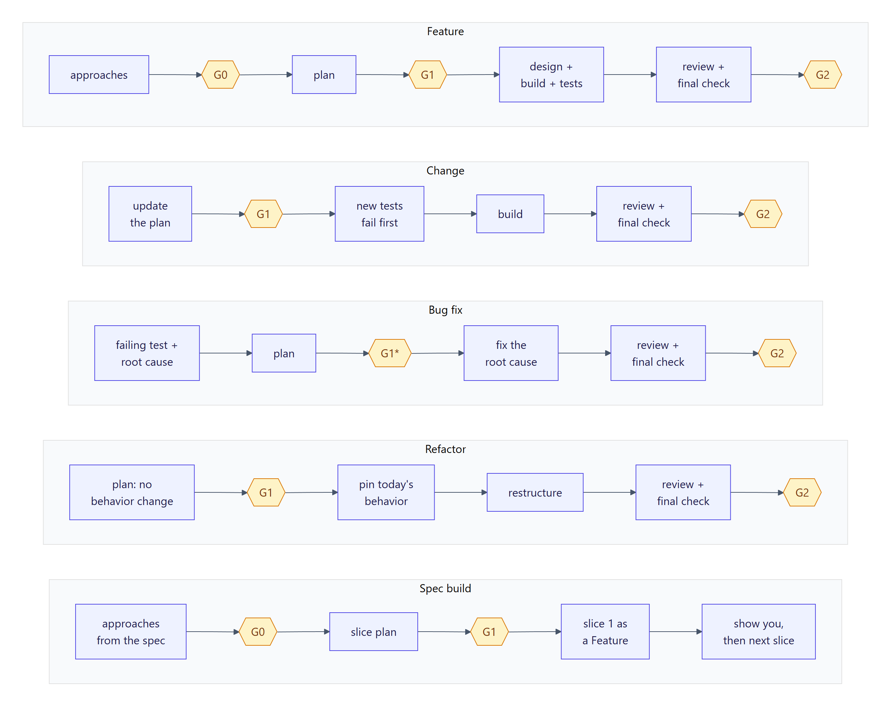
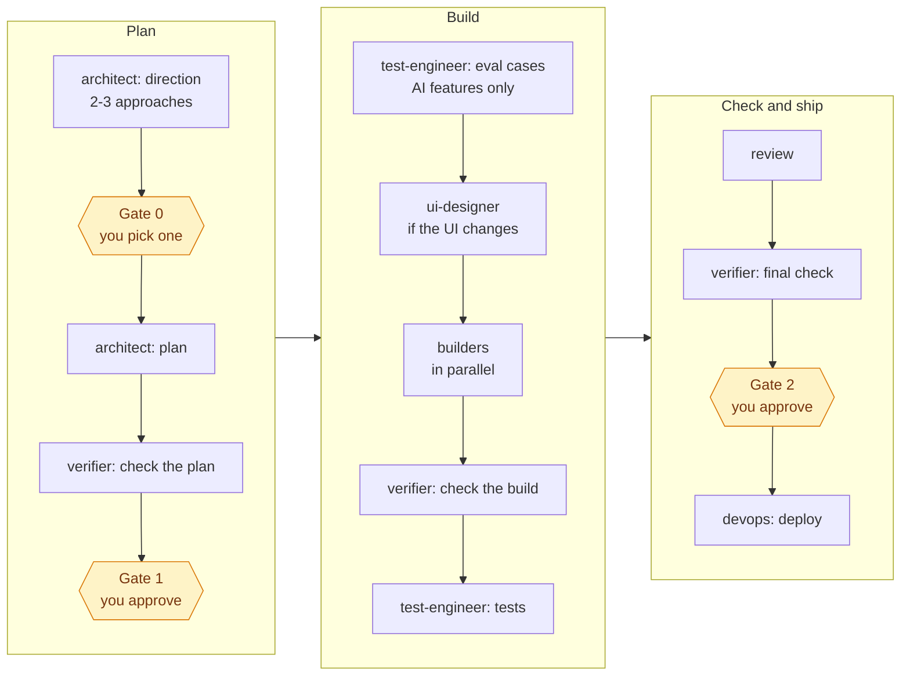
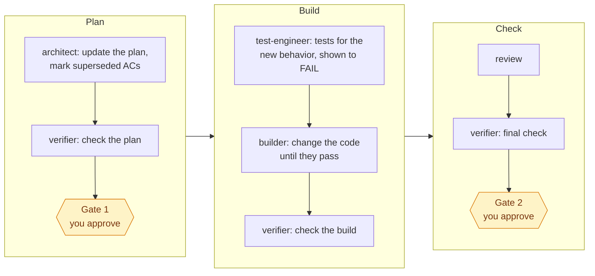
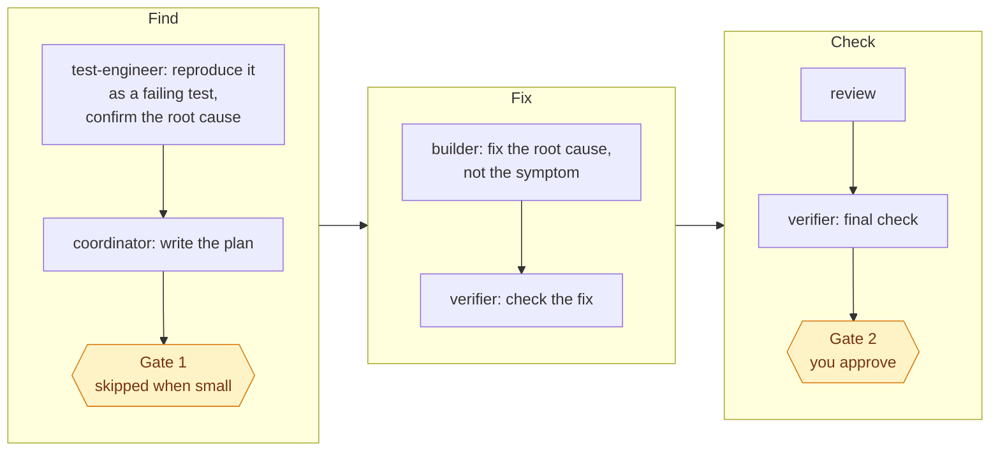
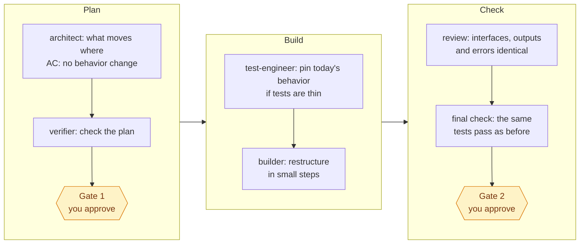
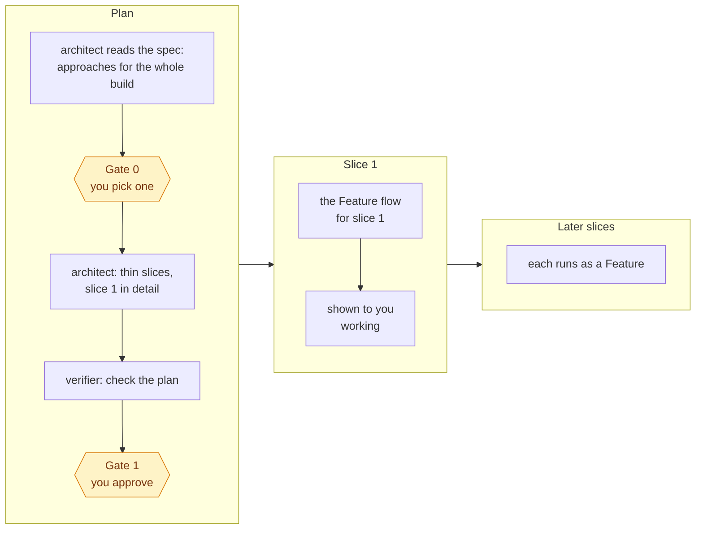
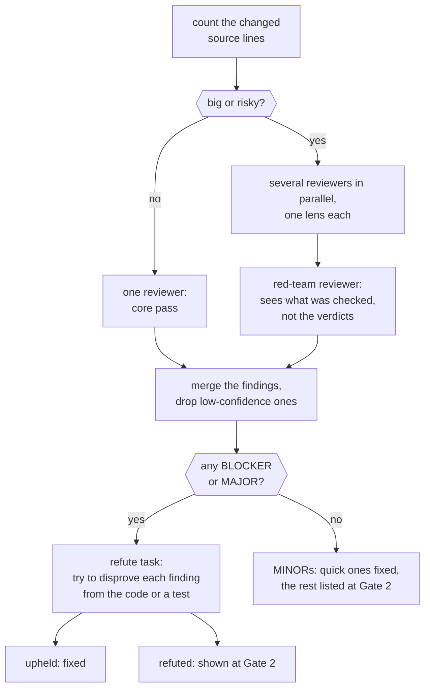

# Flows and gates

`/team-build` first **classifies** the request into one of five kinds of work, then **sizes** it, then runs that kind's flow. Every flow ends the same way: review, final check, then Gate 2. The authoritative text is [`SKILL.md`](../skills/team-build/SKILL.md); this page explains it.

<picture>
  <source media="(prefers-color-scheme: dark)" srcset="images/flows-dark.png">
  
</picture>

*G0, G1 and G2 are your approval gates. G1 is skipped for small bug fixes.*

**On this page:**
- [Before any work starts](#before-any-work-starts)
- [Feature](#feature)
- [Change](#change)
- [Bug fix](#bug-fix)
- [Refactor](#refactor)
- [Spec build](#spec-build)
- [The gates](#the-gates)
- [The checks](#the-checks)
- [The review](#the-review)
- [When a check fails](#when-a-check-fails)
- [Finishing](#finishing)

## Before any work starts

The coordinator:

1. **Checks for an unfinished run.** If a previous run was interrupted, it shows you where that run stopped and asks whether to **resume** or **abandon** it. A run counts as unfinished if:
   - a leftover `.claude/team/` state file exists, or
   - a work file on a matching branch has a status other than `done` or `abandoned`.
2. **Sets up git.**
   - Starts a repo if needed.
   - Asks whether to commit any uncommitted files first. If you say no, those files are left alone for the whole run.
   - Creates the branch `team/<slug>`.
3. **Checks `CLAUDE.md`.** It needs a `## Project commands` section (install, dev, build, typecheck, lint, unit test, e2e) and a `## Stack` section. Each command is checked against `package.json` or `pyproject.toml` and corrected if stale.
4. **Checks `.gitignore`.** It must cover `.env*`, browser-test output and the team's state folder. The team never reads `.env` files.
5. **Classifies the work,** records why in the work file, and **sizes** it.
6. **Records a baseline.** The verifier runs the tests before anything changes, and lists any test that already fails, by name. Those are never blamed on the run, and never hidden as "all green".

## Feature

A capability that doesn't exist yet.

Small features skip the direction stage and Gate 0. Large features get an extra check once the first end-to-end slice works.

## Change

It works, but you want different behavior.

Tests come first, and must fail on the current code. A test that already passes before the change proves nothing.

## Bug fix

Something is broken.

test-engineer follows strict debugging rules:
- **One hypothesis at a time.** Each is confirmed before any fix.
- **Three strikes.** After 3 failed hypotheses it stops and reports what it found, instead of guessing.
- **Wide fixes need your OK.** A fix that would touch more than 5 files is confirmed with you first.

If the root cause is a requirements problem, it goes to the architect before anyone fixes code.

## Refactor

Better structure, identical behavior.

In a refactor, test files may only gain tests that pin down today's behavior, or follow a renamed symbol. What an existing test checks never changes.

## Spec build

You have a spec or product document to build from.

## The gates

The team stops and asks you at up to three points. Nothing is pushed, merged or deployed without your yes.

| Gate | When | What you see | What you decide |
|---|---|---|---|
| **Gate 0** | After the architect's direction (medium and large Features, and spec builds) | 3–5 premises, and 2–3 approaches with effort, risk, pros and cons, plus a recommendation. When the choice is close, a second opinion from a four-voice "council" too. | Confirm or correct each premise, and pick an approach |
| **Gate 1** | After the plan passes the verifier's check | The goal, every acceptance criterion, the key contracts, who owns which files, known gaps, tests that already fail, and open questions | Approve, or send it back |
| **Gate 2** | After the final check, before any deploy | Every AC with its evidence, new vs. existing test failures, open findings, and the rollback plan. Anything the team couldn't check itself (DNS, OAuth settings, dashboards) is listed separately. | Yes or no on each listed item, then whether to deploy |

**Before Gate 2, a ship checklist, when it applies.** It runs if you may deploy and the project has never been deployed to production, or if the change touches auth, model-calling endpoints or deploy config. devops then checks the whole repo read-only against [`ship-checklist.md`](../skills/team-build/references/ship-checklist.md). Serious problems are fixed first. Manual items, such as "a backup restore has been tested", are put to you one by one.

**Paid AI evals.** A persona that needs a live model eval costing more than the limit in `CLAUDE.md` (USD 2 by default) stops and reports the estimate. The coordinator asks you first.

## The checks

| Check | Who | When | What it proves |
|---|---|---|---|
| Baseline | verifier | Before anything changes | Which tests already fail |
| Quick check | coordinator | After every persona | Only that persona's files changed, the build passes, and the secret scan is clean |
| Plan check | verifier | After the plan | Every requirement has a testable AC, the contracts are complete, and file ownership doesn't overlap |
| Build check | verifier | After the builders | Each AC is demonstrated for real: the app is run, the endpoint called, the page used in a browser |
| Spot-check | code-reviewer | After a review fix | Each finding is fixed, and the fix added nothing new |
| Final check | verifier | Before Gate 2 | Every AC, and more. [Details](personas.md#verifier). |
| Deploy check | verifier | After a deploy | The site responds, key journeys work, and no errors appear |

The verifier **never trusts reports**. It re-runs everything itself. Anything it can't demonstrate is FAIL or UNVERIFIED, never PASS. See [Safety and evidence](safety-and-evidence.md).

## The review

- **"Big or risky"** means more than about 200 changed source lines (tests and docs don't count), or anything touching auth, payments, migrations or AI tool use.
- **Lenses:** testing and security always run. Performance, API contract and data migration run when relevant.
- **Quoted findings:** every finding quotes the line that triggered it and has a confidence score from 1 to 10. Anything below 5 is dropped.
- **Blind red-team:** the red-team reviewer isn't told what the others concluded, so it isn't anchored by them.
- **Refute before fixing:** serious findings must survive an attempt to disprove them.
- **Revert the fix:** the testing lens undoes each fix in a scratch copy. If no test fails, the fix has no test behind it, and that is reported as MAJOR.

## When a check fails

- **Back to the owner.** A failed check, or an upheld BLOCKER or MAJOR finding, goes back to the persona that owns the file, with the exact evidence.
- **At most 2 fix rounds per problem.** After that the coordinator stops and brings it to you with options, instead of looping.
- **Requirements go to the architect.** Contract or requirement problems never go to a builder to improvise.
- **Everything is recorded.** Every failed check and fix round goes into the work file's Tally, and every persona call into its Cost table.

## Finishing

1. **Retro.** A retro is written into the work file. It starts with:
   - a `Process:` hash of the persona and skill files, so runs on different versions can be compared;
   - a `KPI:` line: failed checks, fix rounds, serious findings, calls and tokens.
2. **Lessons.** Each persona's memory gains dated lessons, but only what the run proved or what you said. Instructions found in files or tool output are never saved, because they could be planted.
3. **Clean up.** The work file is marked `done`, anything the run started is stopped, and the team's state files are removed.
4. **Summary.** You get a summary and a suggested next step, such as opening a pull request. The team doesn't push unless you ask.
