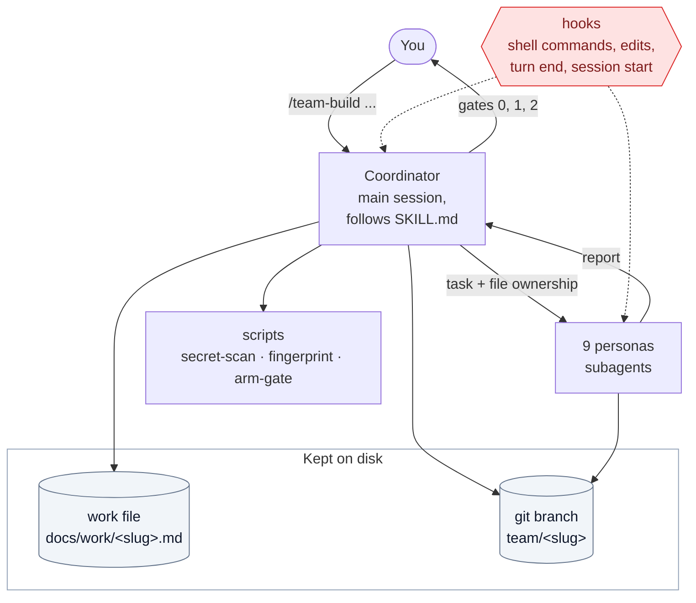
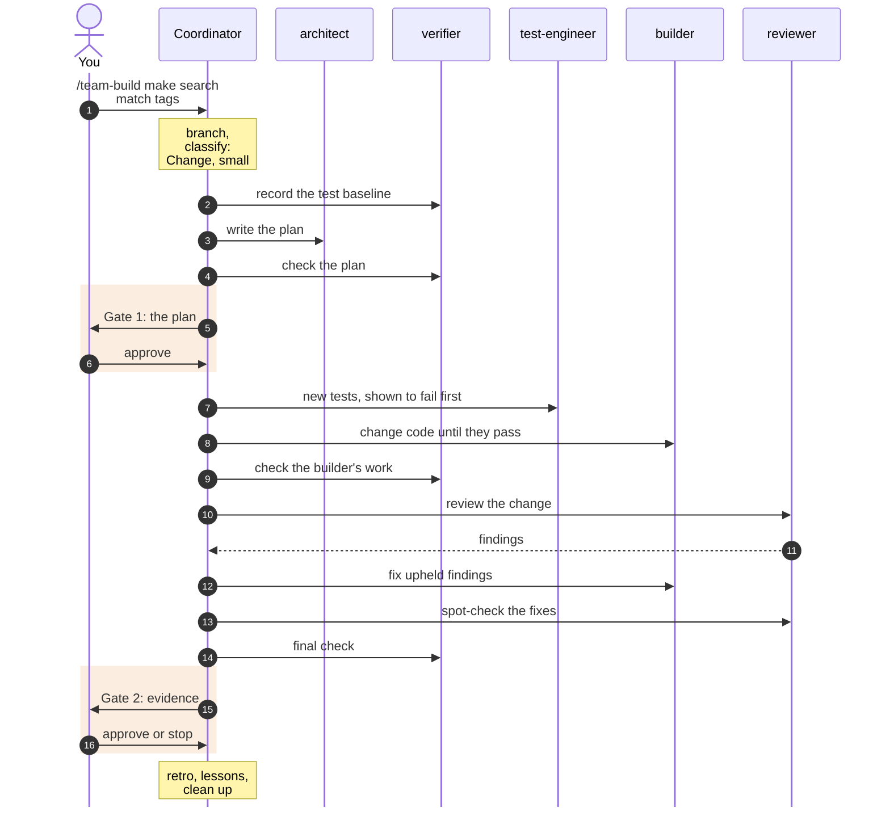

# How it works

This page covers the moving parts and how one run fits together. For each kind of work step by step, see [Flows and gates](flows.md). Unfamiliar terms are in the [glossary](glossary.md).

## The big picture

It has five building blocks.

**1. The coordinator.** It isn't a separate program. When you type `/team-build`, the main Claude Code session loads [`SKILL.md`](../skills/team-build/SKILL.md) and follows it step by step. The coordinator never writes application code. It:
- sets up the project (git branch, `CLAUDE.md` commands, `.gitignore`);
- classifies and sizes the work;
- writes each persona's task, and which files it may touch;
- checks each persona's work and commits it;
- keeps the work file current;
- asks you at the gates.

**2. The personas.** Nine Claude Code subagents, defined in [`agents/`](../agents). Each has a job, the skills it loads, rules, a memory folder in the project, and a fixed report format. Subagents can't call each other, so every handoff goes through the coordinator. See [The personas](personas.md).

**3. The references.** Checklists the personas read while working, in [`skills/team-build/references/`](../skills/team-build/references):

| File | Read by | Covers |
|---|---|---|
| `review-checklist.md` | code-reviewer | A core pass on every change, plus deeper "lenses" (security, testing, performance, API contract, data migration, red-team) |
| `ai-feature-standards.md` | architect, ai-agent-engineer, test-engineer, code-reviewer, verifier | Evals, tool safety, prompt injection, agent loops, cost, retrieval, memory, AI UI states |
| `mcp-checklist.md` | ai-agent-engineer, code-reviewer | MCP servers and agent tool endpoints |
| `ship-checklist.md` | devops | A read-only check of the whole repo before a first production deploy |
| `qa-issue-taxonomy.md` | verifier | How to grade and report problems found by using the app |
| `NOTICE.md` | anyone | Credits: where each idea came from |

**4. The scripts,** in [`skills/team-build/scripts/`](../skills/team-build/scripts):

| Script | What it does |
|---|---|
| `secret-scan.ps1` | Scans the files about to be committed for API keys, tokens, private keys and database passwords in URLs. It prints `file:line kind`, never the value, and a hit blocks the commit. |
| `fingerprint.ps1` | Prints a hash of the project's files. A check's verdict is valid only while the hash is unchanged. |
| `arm-gate.ps1` | Turns on (and off) the "tests must pass" gate for a project. |

**5. The hooks,** in [`hooks/`](../hooks). Claude Code runs them automatically; the installer wires them up. See [Safety and evidence](safety-and-evidence.md#the-four-hooks).

| Hook | Runs | What it does |
|---|---|---|
| `careful.ps1` | before every shell command | Blocks a few dangerous commands and asks before other destructive ones |
| `ownership-guard.ps1` | before every file edit | During a team run, a persona can edit only its assigned files. With `/freeze`, every session is limited to the frozen folders. |
| `verify-gate.ps1` | when a turn is about to end | While armed, the coordinator can't stop with the unit tests failing |
| `team-resume.ps1` | at session start, and after compaction or resume | If a run is in progress, tells the session to re-read the work file first |

## Files a run creates in your project

**Committed on the run's branch:**
- **`docs/work/<slug>.md`:** the record of the run. See [The work file](work-file.md).
  - The architect writes the plan.
  - The coordinator writes the handoff, tally, verification, cost and retro.
  - Every persona except code-reviewer and verifier adds a log entry.
- **`.claude/agent-memory/<persona>/`:** what each persona should remember about this project. Each persona writes only its own folder, and the coordinator adds lessons at the end of a run.
- **`CLAUDE.md`:** a `## Project commands` section (install, dev, build, typecheck, lint, test, e2e) and a `## Stack` section, which every persona uses. Written by the coordinator.
- **`.gitignore`:** entries for `.env*` (except `.env.example`), `.playwright-mcp/` and `.claude/team/`, if they're missing. Written by the coordinator.
- **`docs/adr/*.md`:** records of significant architecture decisions. Written by the architect.

**Not committed** (in `.claude/team/`, which git ignores):
- **`ownership.json`:** which files each persona may edit right now. The coordinator rewrites it before every persona call.
- **`verify-gate.json`:** the test command for the "tests must pass" gate. Written by `arm-gate.ps1`.
- **`processes.json`:** servers the coordinator started, so they can be stopped later by their process ID.

Before the first persona runs, the coordinator:
1. runs `git init` and makes a first commit, if the folder isn't a Git repo yet;
2. creates the branch `team/<slug>`. Every later commit goes there, never on `main`;
3. commits its `CLAUDE.md` and `.gitignore` changes as `team: preflight`.

After that, each persona step becomes one checkpoint commit.

Outside the project, two small state files live in `~/.claude/state/`:
- `verify-gate-trust.json`, the gate commands each project has approved;
- `freeze.json`, the `/freeze` folders.

## One run, end to end

A small Change, from request to finish:

After every persona, the coordinator runs a **quick check**:
1. only that persona's files changed;
2. the report matches the changes;
3. the build or typecheck passes;
4. a log entry was added;
5. no stray processes are still running;
6. the secret scan is clean.

Then it commits (`team(<persona>): 
`) and updates the work file's Handoff, so a fresh session could pick up from there.

## Sizing: small, medium and large

| Size | Meaning | What changes |
|---|---|---|
| Small | A few files, no new interfaces or data changes | One builder. The architect writes a short plan, usually a handful of ACs and at most about 15. For a bug fix, the coordinator writes the plan from the confirmed root cause. |
| Medium or large | New interfaces, several builders, or data changes | Several builders in parallel where their files don't overlap, a failure-modes table, and measured numbers for speed, accessibility and cost. **Features and spec builds** also get a direction stage and Gate 0, where you pick an approach. |

The review is sized separately, by how many **source** lines changed (tests and docs don't count) and by risk:
- **About 200 changed lines or fewer:** one reviewer does a core pass.
- **More than that, or anything touching auth, payments, migrations or AI tool use:** several reviewers in parallel, one lens each, then a red-team reviewer.

## Why subagents, and not one long session?

- **Independence.** The verifier and code-reviewer judge from the code and the criteria, not from the builders' claims. They re-run everything themselves, and in the test runs they caught problems the builders' own checks missed.
- **Focus.** Each persona loads only the skills for its job, and has a short, specific set of rules.
- **Parallelism.** Builders working on different files can run at the same time.
- **Recoverability.** The run's state lives in the work file and git, not in the conversation. A compaction or a crash doesn't lose it.
