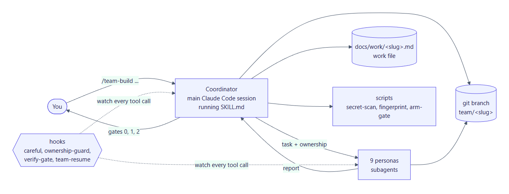
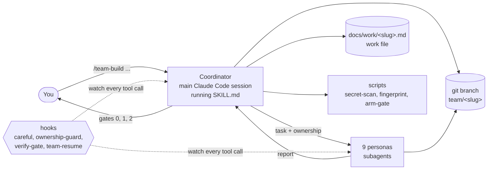
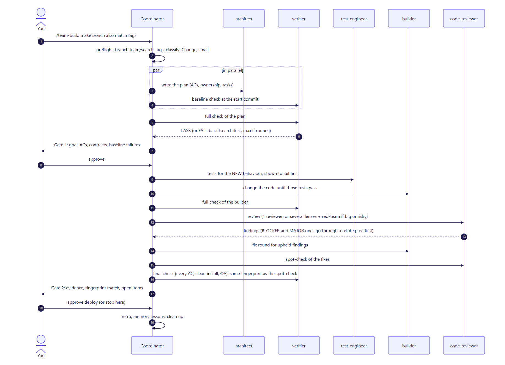
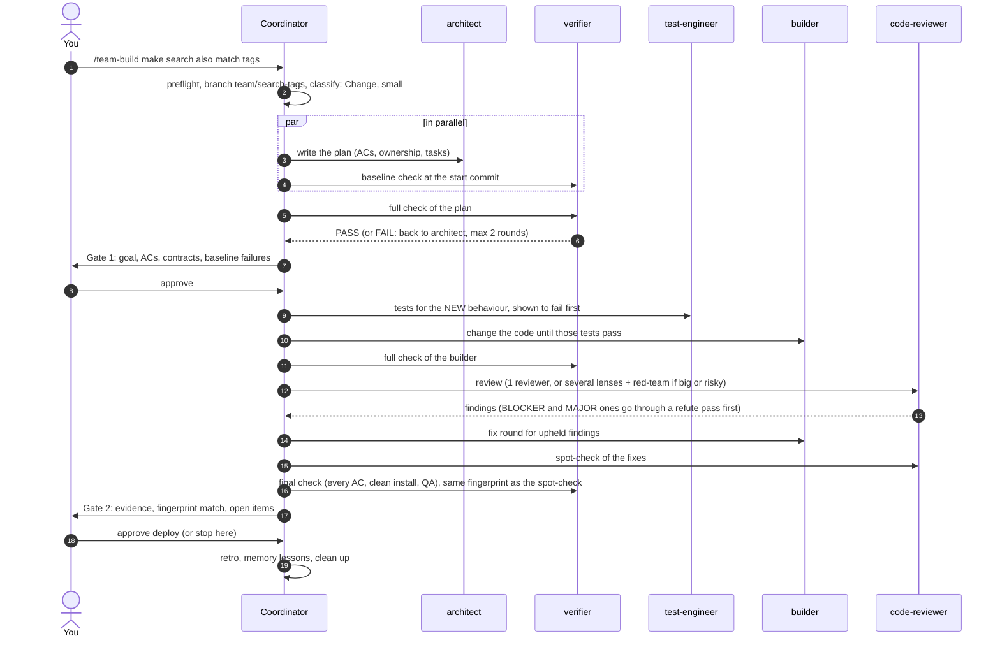

# How it works

This page covers the moving parts and how a run fits together. For the step-by-step flows, see [Flows and gates](flows.md).

## The big picture

There are five kinds of parts.

**1. The coordinator.** The coordinator is not a separate program. When you type `/team-build`, the main Claude Code session loads [`skills/team-build/SKILL.md`](../skills/team-build/SKILL.md) and follows it step by step. It never writes application code. Its jobs are:
- preflight: git, CLAUDE.md commands, `.gitignore`;
- classifying and sizing the work;
- writing each persona's task and its file ownership;
- the quick check and commit after every persona;
- keeping the work file current;
- asking you at the gates.

**2. The personas.** Nine Claude Code subagents, defined in [`agents/`](../agents). Each has:
- a job;
- the skills it preloads;
- rules;
- a memory folder in the project (`.claude/agent-memory/<persona>/`);
- a fixed report format.

Subagents can't call each other, so every handoff goes through the coordinator. See [The personas](personas.md).

**3. The references.** The checklists the personas read while working, in [`skills/team-build/references/`](../skills/team-build/references):

| File | Used by | Covers |
|---|---|---|
| `review-checklist.md` | code-reviewer | Core pass on every diff, plus deep "lenses" (security, testing, performance, api-contract, data-migration, red-team) |
| `ai-feature-standards.md` | ai-agent-engineer, test-engineer, code-reviewer, verifier | Evals, tool safety, prompt injection, loops, cost, retrieval, memory, AI UI states |
| `mcp-checklist.md` | ai-agent-engineer, code-reviewer | MCP servers and agent tool endpoints |
| `ship-checklist.md` | devops | A read-only whole-repo check before a first production deploy |
| `qa-issue-taxonomy.md` | verifier | Exploratory QA severity and evidence format |
| `NOTICE.md` | everyone | Where each idea came from (third-party credits) |

**4. The scripts.** PowerShell tools in [`skills/team-build/scripts/`](../skills/team-build/scripts):

| Script | What it does |
|---|---|
| `secret-scan.ps1` | Scans the **staged** diff for keys, tokens, private keys and credentials in URLs. Prints `file:line kind`, never the value. Exit 1 blocks the commit. |
| `fingerprint.ps1` | Prints a hash of the working tree's content, leaving out work files and memory. A verdict is still valid exactly while this hash is unchanged. |
| `arm-gate.ps1` | Arms, disarms or removes the verify gate for a project, and writes the trust record the gate needs. |

**5. The hooks.** PowerShell scripts in [`hooks/`](../hooks) that Claude Code runs automatically, wired up in `~/.claude/settings.json` by the installer. They enforce what instructions alone can't. See [Safety and evidence](safety-and-evidence.md#the-four-hooks).

| Hook | Event | Blocks or adds |
|---|---|---|
| `careful.ps1` | before Bash / PowerShell | Denies deleting a drive or home root, force-pushing main, and killing processes by name. Asks before other destructive commands. |
| `ownership-guard.ps1` | before Edit / Write | During a team run, a persona can edit only its assigned files. With `/freeze`, every session is limited to the frozen folders. |
| `verify-gate.ps1` | when a turn ends | While armed, the coordinator can't end its turn with the unit tests failing. |
| `team-resume.ps1` | session start, compaction, resume | If a run is in progress, tells the session to re-read the work file before doing anything. |

## Files a run creates in your project

| Path | Written by | Committed? | Purpose |
|---|---|---|---|
| `docs/work/<slug>.md` | architect (plan), coordinator (handoff, tally, verification, cost), every persona (log) | yes | The single source of truth for the run. See [The work file](work-file.md). |
| `.claude/agent-memory/<persona>/` | each persona (its own folder only) | yes | Lessons for next time in this project |
| `.claude/team/ownership.json` | coordinator, before every persona call | no (gitignored) | Which files each persona may edit right now |
| `.claude/team/verify-gate.json` | `arm-gate.ps1` | no | The armed test command for the verify gate |
| `.claude/team/processes.json` | coordinator | no | PIDs of servers it started, so they can be stopped by PID after a compaction |
| `docs/adr/*.md` | architect | yes | Architecture decision records, when a decision is significant |
| `CLAUDE.md` (`## Project commands`, `## Stack`) | coordinator | yes | Install, dev, build, typecheck, lint, test and e2e commands that every persona uses |
| `.gitignore` | coordinator | yes | Adds `.env*` (except `.env.example`), `.playwright-mcp/` and `.claude/team/` if they're missing |

Before the first persona runs, the coordinator:
1. **Git repo:** if the project isn't a git repo, it runs `git init` and makes an initial commit on your current branch.
2. **Branch:** it creates `team/<slug>`. Every later commit goes there, never on `main`.
3. **Preflight commit:** it commits the `CLAUDE.md` and `.gitignore` changes as `team: preflight`.

After that, each persona step becomes one checkpoint commit.

Outside the project, the setup keeps two small state files in `~/.claude/state/`:
- `verify-gate-trust.json`: which gate command each project has trusted;
- `freeze.json`: the `/freeze` folders.

## One run, end to end

(See the [glossary](glossary.md) for AC, lens, red-team, refute and the other terms.)

After each persona the coordinator runs the **quick check**:
1. the diff only touches that persona's files;
2. the report matches the diff;
3. the build or typecheck passes;
4. a Log entry exists;
5. no stray processes are left running;
6. the secret scan passes.

Then it makes a checkpoint commit (`team(<persona>): 
`) and rewrites the work file's Handoff section, so a fresh session could pick up from there.

## Sizing: small vs medium and large

| Size | Meaning | What changes |
|---|---|---|
| **Small** | A few files, no new interfaces or data changes | No direction stage or Gate 0. The architect still writes a short plan: a handful of acceptance criteria, and never more than about 15. One builder. For a bug fix, the coordinator writes the plan from the confirmed root cause. |
| **Medium / large** | New interfaces, several builders, data changes | The full flow: direction stage, Gate 0, a failure-modes table, measured non-functional numbers, parallel builders where ownership allows. |

The review step has its own sizing. Only changed **source** lines count toward its threshold; tests and docs don't:
- **Up to about 200 changed lines:** one reviewer does a core pass.
- **More than that, or anything touching auth, payments, migrations or AI tool use:** parallel lenses plus a red-team reviewer.

## Why subagents and not one long session?

- **Independence.** The verifier and code-reviewer never see the builders' reasoning, only the code and the criteria. They re-run everything themselves, and in the test runs they caught defects the builders' own evidence missed.
- **Focus.** Each persona preloads only the skills for its job and has a short, specific rule set.
- **Parallelism.** Builders with separate files can run at the same time.
- **Recoverability.** The coordinator's state lives in the work file and git, not in the conversation, so a compaction or crash doesn't lose the run.
