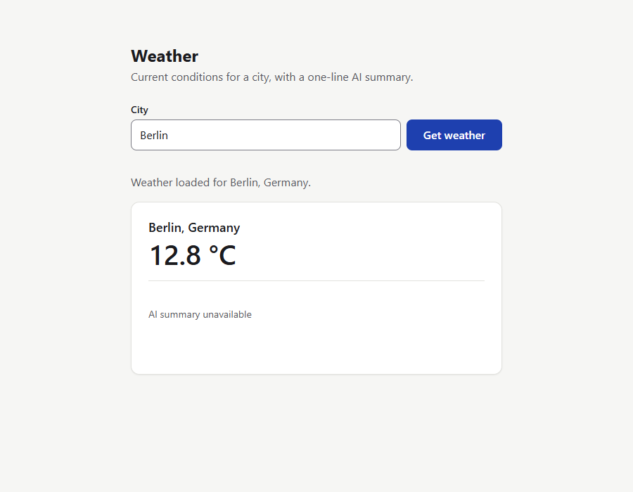

# Lessons learned

Before this setup was shared, it was tested with eight `/team-build` runs on a small throwaway Node.js project: a notes API that grew a weather endpoint, a web page, an AI one-line summary and an MCP tool. Each run's retro recorded:
- what failed;
- what it cost;
- which check caught each problem.

After the runs, the setup was changed wherever a retro showed a real gap. This page explains why many of the rules exist.

## The runs

| # | Run | Work type | Size | Persona calls | Subagent tokens | Failed checks | Fix rounds | Serious findings |
|---|---|---|---|---|---|---|---|---|
| 1 | weather endpoint (fixture data) | Feature | medium | not tracked yet | not tracked yet | 2 (plan) | 3 | 2 MAJOR |
| 2 | weather from a live API (Open-Meteo) | Feature | medium | 27 | 2.76M | 4 | 4 | 1 MAJOR |
| 3 | `/notes/:id` returns 500 | Bug fix | small | 6 | 0.40M | 0 | 0 | 0 |
| 4 | invalid city: 400 → 422 | Change | small | 8 | 0.44M | 1 (plan) | 1 | 0 |
| 5 | notes routes into a module | Refactor | small | 13 | 0.76M | 2 (plan) | 2 | 0 |
| 6 | web page + AI summary + MCP tool | Spec build | 1 slice | 33 | 4.35M | 3 | 4 | 2 MAJOR |
| 7 | AI output checker: hidden sentences, invisible characters, bare links | Change | small | 15 | 1.24M | 3 | 3 | 1 MAJOR |
| 8 | AI output checker: text after a full stop | Change | small | 15 | 1.43M | 1 | 1 | 1 MAJOR |

**Across all eight runs, no defect was found after review.** Everything the team shipped to its final check passed it.

*Run 6 built this page from a one-page spec. It shows the weather for a city, and a one-sentence AI summary that is checked before it's shown. Here no API key was set, so it shows the muted "AI summary unavailable" state. The verifier checked keyboard use, focus, reflow at 320 px, contrast (6.4:1 to 17:1) and page speed in a real browser.*

## What the checks caught

Some defects only one kind of check could have found:

| Defect | Caught by | Missed by | Now enforced by |
|---|---|---|---|
| A server crashed when its output pipe closed (EPIPE) | verifier (live probe with pipes closed) | 79 builder checks | builders' **real-socket check**; red-team live crash probe |
| An MCP server aborted inside Node after a *real* network call, then stdin closed (twice, on two exit paths) | verifier (live run without the network block) | every test, because the tests blocked the network | builders' real-socket check; test-engineer's shutdown rule |
| One malformed request line could kill the server (URL parsed outside `try`) | red-team reviewer | 3 other lenses | failure-modes rule on request parsing; red-team class |
| Validate-then-reread: a hostile getter returns a different value on the second read | 3 lenses; red-team proved the crash | n/a | architect failure-modes rule; red-team class |
| An unread response body left sockets open | performance and red-team lenses | security and testing lenses | red-team defect class |
| Rate limiter lockout: one IPv6 /64 fills the map and locks everyone out | red-team (then security and performance agreed) | n/a | security lens item: key IPv6 by /64 |
| A redirect forwards the `x-api-key` header to another host | red-team (local 307 stub) | n/a | security lens item: `redirect: 'error'` on keyed calls |
| A fix from two fix rounds had **no test that could fail** | testing lens (reverted the fix, and all tests still passed) | the fix's own tests | testing lens: **revert the fix** rule |
| Combining marks after a dot hid a link or a sentence from the output checker | core review | the plan | AI standards and checklist probes |
| A list of allowed characters left about 9,400 others that still hid a sentence | core review, with a full code-point sweep | the plan's own examples | architect self-check: **close the whole class** |
| Key-like strings in test fixtures and in a persona's memory notes (4 times) | secret scan | the authors | secret scan on **every** commit, memory included |

## What changed, and why

Each change below was made because a run showed the need. The retros record a `Process:` hash, so runs before and after each change can be compared.

**Planning**
- **Timing numbers are measured before they become criteria** (after run 1). Run 1's plan failed twice: its timing criteria couldn't be met on the actual machine, and two criteria contradicted each other. A 20 ms latency bound was set before anyone measured that each `fetch` there costs about 16 ms. Fixing that bound then broke the 5-second test-suite budget. Once timing was measured during planning, no later run had a timing failure.
- **The architect writes small plans too** (after run 7). Plans the coordinator wrote itself failed their plan check in 3 of 3 runs, even with a checklist. The causes were criteria that contradicted each other, checks that ignored known failures, and text damaged by escaping. In the next run, the architect's small plan **passed on the first try**.
- **The plan self-check** (after runs 7 and 8):
  - put every example through a stand-in of *all* the rules together;
  - build special characters from code points and scan for invisible ones (a `\b` had silently become a backspace character);
  - for filters and validators, sweep the whole input class.
- **An AC budget** (after run 6). The "small" spec build still had 38 acceptance criteria, so small work is now capped at about 15.

**Building**
- **A scope rule and a `Not tested:` line** for builders, so gaps are stated rather than implied.
- **The real-socket check** (after runs 2 and 6). Two crash types only appeared with a real network and real pipes.

**Review**
- **Review size counts source lines only** (after run 6). Test lines had pushed small changes into the full multi-lens review. In run 7 the new measure counted 15 source lines instead of about 110, and the single reviewer still found the one MAJOR.
- **Revert-the-fix testing** (after run 6).
- **Checklist items** from every run's findings: IPv6 limiter keys, redirects on keyed calls, fixture evals at 100%, output-checker probes.

**Coordination**
- **Findings are written to the work file immediately** (after run 6). A context compaction lost the review verdicts, and the coordinator had to dig them out of the transcript.
- **The resume hook also fires at session start**, so an interrupted run is offered for resume even in a fresh session.

## What worked from the start

- **Independent verification.** The verifier re-ran everything itself and caught problems the builders' own evidence missed in several runs.
- **The red-team lens.** It found the most serious problem in both of the big runs.
- **Baselines.** A pre-existing failing test was carried through all eight runs, reported as "1 pre-existing failure, unchanged", and never blamed or hidden.
- **Fingerprints.** Every review and final check was tied to the exact code it examined.
- **The refute pass.** It upheld every serious finding it was given (7 of 7), so there were no false alarms. It also means there's no evidence yet that it filters any out.

## Not yet tested

Be aware of what these runs didn't cover:
- **A real deploy.** Every run stopped at Gate 2 with "no deploy", so devops's deploy and the verifier's deploy check have never run for real.
- **Gates answered by a real user.** To keep the test runs moving, the repo owner gave standing answers for every gate ahead of time ("approve the plan", "don't deploy"), so no gate was ever decided live. Whether Gate 0 premise ratings or other gate changes are needed will only show up in real use.
- **Live paid evals.** No API key was used, so AI evals ran on recorded fixtures only.
- **Projects with auth.** The test project had no login, so auth-specific tests (401/403) and reviews haven't been exercised.
