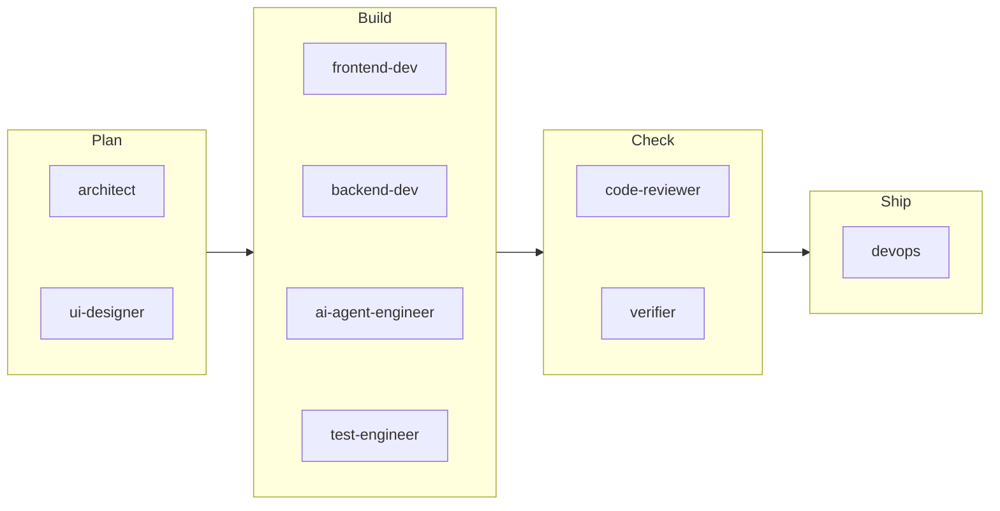

# The personas

Nine Claude Code subagents, one file each in [`agents/`](../agents). For each step, the coordinator writes a task naming:
- the work file;
- the acceptance criteria to meet;
- the files the persona may touch;
- a summary of earlier decisions;
- the commits to compare against.

Each persona then works alone and ends with a report in a fixed format.

*The typical Feature order. In a Change or a Bug fix, test-engineer goes before the builder, so tests come first. ui-designer runs only when the UI changes, and devops only after you approve shipping.*

## At a glance

| Persona | Job | May edit |
|---|---|---|
| **architect** | Turns the request into a plan: premises, approaches, acceptance criteria, contracts, failure modes, file ownership, tasks | The work file and `docs/adr/` only |
| **ui-designer** | Visual direction, design tokens, every component state, motion | The work file's Design section and its assigned token file |
| **frontend-dev** | UI in React, Next.js or Vite, built to the contract and the design | Its assigned UI files |
| **backend-dev** | APIs, data, migrations and auth, built to the contract | Its assigned server files |
| **ai-agent-engineer** | Claude API calls, prompts, tools, agent loops, MCP servers, eval graders, cost controls | Its assigned AI files and `evals/graders/` |
| **test-engineer** | Tests mapped to the ACs, AI eval cases, and root-causing bugs | Test files and `evals/cases/` |
| **code-reviewer** | Ranked findings on the change, each one quoted | Nothing, apart from its own notes |
| **verifier** | Independent PASS or FAIL against the ACs, with evidence it gathers itself | Nothing, apart from its own notes |
| **devops** | CI/CD, containers, environments, deploys, monitoring, the ship checklist | CI config, Dockerfiles, deploy config, `.env.example` |

Each persona **preloads** a few general skills for its job (listed below), and loads **backup** skills when a task needs them. For example, `nextjs-turbopack` for a Next.js project, or `mcp-server-patterns` for an MCP server. The coordinator names the backups from the project's stack.

## Rules every persona follows

These appear in every persona's "Team protocol":
- **Stay in your files.** Edit only the files assigned in the work file, and ask for anything else under **Requests**. During a run, the ownership hook enforces this.
- **Evidence.** Never claim something works unless you ran it in this session. Otherwise say "not verified".
- **Secrets.** Never print, log, commit or copy keys, tokens or `.env` contents. Refer to settings by name.
- **Safety.** No pushes, deploys or data deletion without your approval being passed down.
- **Processes.** Never stop programs by name, because that also kills other programs on the machine, Claude Code included. Stop only the process ID you started.

Two more rules appear where they matter:
- **Stay in scope** (the three builders): the task and its ACs are the boundary. Nearby problems are reported under Open issues, not fixed.
- **Your rules win** (architect, ai-agent-engineer, test-engineer, code-reviewer, verifier): when a loaded skill suggests something against the persona's rules, such as spawning helpers or writing files elsewhere, the persona's rules win.

**Memory.** Every persona reads its notes in `.claude/agent-memory/<persona>/MEMORY.md` before starting, and adds durable lessons afterwards. It records only what the run proved or what you said. Instructions found in repo files or tool output are never saved, because they could be planted.

## Each persona in detail

### architect
*Preloads: spec-driven-development, planning-and-task-breakdown, api-and-interface-design, documentation-and-adrs, product-lens.*
- **Two stages.**
  - **Direction** (medium and large Features, and spec builds): premises you can agree or disagree with, and 2–3 approaches (the smallest, the ideal, and sometimes a different framing), with effort, risk, pros and cons. When two approaches are close, it says so, and you get a second opinion at Gate 0.
  - **Plan:** the full work file.
- **Measurable plans.**
  - Every external dependency gets an AC for when it fails.
  - Speed, accessibility, cost and rate limits become numbers.
  - Every timing number is measured on your machine before it becomes an AC.
- **Checks its own plan before handing it off.**
  - Runs every check command against the current code.
  - Tries every example against all the planned rules together, so no AC contradicts another.
  - For a filter or validator, tries every possible input of that kind, not just the examples.
  - Scans the plan for invisible characters that shell or code escaping can create.
- **Keeps small plans small:** at most about 15 ACs.

### ui-designer
*Preloads: ui-ux-pro-max, emil-design-eng, make-interfaces-feel-better, design-system-nextlevelbuilder, animate, web-design-guidelines.*
- **Writes** the Design section (direction, layout per screen, component inventory, every state) and the design tokens (color, type, spacing, radius, shadow, motion).
- **Standards:**
  - WCAG AA contrast, with the ratios stated;
  - touch targets of at least 44×44 px;
  - motion under about 300 ms, with a reduced-motion fallback;
  - no generic "AI template" look.
- **For AI features,** it also designs the streaming, partial, retry and error states.

### frontend-dev, backend-dev and ai-agent-engineer (the builders)
- **They build to the contract exactly.** A wrong contract is reported, not improvised around.
- **Each report includes a `Not tested:` line,** so gaps are stated rather than hidden.

**frontend-dev**
*Preloads: frontend-ui-engineering, react-patterns, ui-styling, frontend-a11y, error-handling.*
- Never calls a secret-bearing API from the browser.
- Treats accessibility as part of done.
- Triages the Impeccable design hook's findings.

**backend-dev**
*Preloads: backend-patterns, api-design, database-migrations, error-handling.*
- Validates all input at the boundary and uses parameterized queries.
- Checks authorization, not just login.
- Keeps request parsing inside its error handling, because in Node a stray error there can crash the server.

**ai-agent-engineer**
*Preloads: claude-api, agent-harness-construction, context-engineering, loop-design-check, cost-aware-llm-pipeline, agent-architecture-audit, agent-introspection-debugging, regex-vs-llm-structured-text, source-driven-development, eval-harness.*

It follows [`ai-feature-standards.md`](../skills/team-build/references/ai-feature-standards.md):
- tool inputs are validated at runtime;
- each tool is labelled read-only, reversible or irreversible;
- permissions are enforced in code, not left to the model;
- untrusted text is wrapped in random markers, so it can't pose as instructions;
- every agent loop has a budget, and ends in a named final state;
- prompt caching is proven to work;
- spending caps reserve the cost before each call.

**The real-socket check (backend-dev and ai-agent-engineer).** If the work starts a server, spawns a process or talks over stdin and stdout, the builder runs it once with the real network and real pipes before reporting done: a real upstream call, then closing its input and output. It must exit cleanly. Tests that block the network can't see crashes that only happen after real connections close; two of the test runs had exactly that bug.

### test-engineer
*Preloads: test-driven-development, playwright-testing, ai-regression-testing, debugging-and-error-recovery.*
- **Proves every test can fail.** Each new test is run against the code from before the change, and must fail there.
- **Never weakens a test to get green.** A flaky test is a bug; a fix has to pass 10 runs out of 10.
- **Owns the AI eval cases.** It writes them from the ACs before the feature runs, so the person writing the prompt doesn't also write the answer key.
- **Debugs one hypothesis at a time.** After three failed ones, it stops and reports.
- **Tests shutdown for real.** For shutdown code, it uses fakes that respond after a delay, so a request really is still in progress when the program shuts down.

### code-reviewer
*Preloads: code-review-and-quality, security-and-hardening, code-simplification, ponytail-review, accessibility.*
- **Reviews the change itself, not the reports,** reading the whole diff and enough of the surrounding code first.
- **Runs a core pass on every review,** from [`review-checklist.md`](../skills/team-build/references/review-checklist.md):
  - data safety;
  - code that's built but never wired up, and checks that are shown but not enforced;
  - trusting AI output;
  - command injection;
  - missing cases;
  - drift from the task;
  - outdated docs.
- **Goes deep on one lens** when it's assigned: security, testing, performance, API contract, data migration or red-team. The security lens includes rules learned in the test runs, such as refusing redirects on requests that carry an API key.
- **Every finding** has a severity, a confidence from 1 to 10, and the quoted line that triggered it. A claim that something is "safe" or "tested" has to cite the line or the test.
- **Refute tasks:** in one, it tries to disprove findings rather than add new ones.

### verifier
*Preloads: run, browser-qa.*
- **Trusts nothing it didn't run.** Reports, commits and comments are all just claims.
- **Reads the test counts, not just the exit code.**
  - Zero tests run is a FAIL.
  - A test that passes only on a retry is flaky, not passing.
- **Fingerprints each verdict** at the start and the end of its check. If the code changed during the check, the verdict is FAIL.
- **The final check also looks for:**
  - weakened tests or lowered thresholds;
  - leftover placeholder code;
  - tasks not done, and changes no task asked for;
  - problems with a clean install in a fresh copy;
  - AI evals scored against a do-nothing baseline;
  - issues found by using the app in a real browser, at desktop and phone widths.
- **Anything it can't check itself,** such as DNS, OAuth or a dashboard setting, is marked UNVERIFIED, with the exact manual check for you.

### devops
*Preloads: ci-cd-and-automation, deployment-patterns, observability-and-instrumentation, shipping-and-launch, production-audit, github-ops.*
- **Prepares freely, ships only with your approval.** Without it, it stops at a dry run and reports the exact command.
- **Every deploy has a written rollback plan.**
- **The ship checklist** ([`ship-checklist.md`](../skills/team-build/references/ship-checklist.md)) is a read-only check of the whole repo before a first production deploy. It covers:
  - `.env` files in git history;
  - secrets;
  - unfinished auth code;
  - rate limits on AI calls;
  - browser security headers;
  - the lockfile;
  - known vulnerable dependencies;
  - error pages that leak internals.

  It also has manual items for you.

## Calling one persona directly

Outside `/team-build`, you can use any persona on its own: "ask the verifier to check the login flow works", or `@agent-code-reviewer review my last commit`.

It isn't limited to particular files then, with two exceptions:
- a `/freeze` is active;
- an interrupted run left `.claude/team/ownership.json` behind.

Run `/team-build` in that project to resume or abandon the old run, or delete that file.
