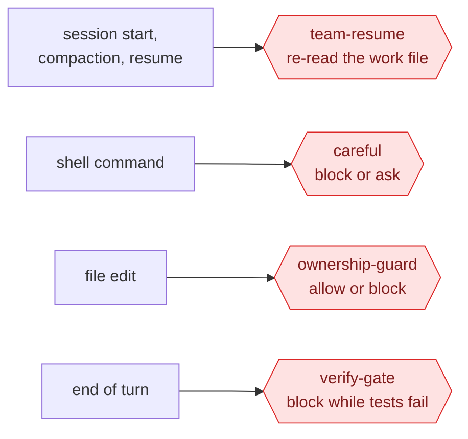

# Safety and evidence

A team of AI agents is only useful if you can trust its "PASS". This page covers what makes a verdict mean something, and the four hooks that enforce rules instructions alone can't.

**On this page:**
- [Evidence rules](#evidence-rules)
- [The baseline](#the-baseline)
- [Fingerprints](#fingerprints)
- [The secret scan](#the-secret-scan)
- [The four hooks](#the-four-hooks)
- [Turning a hook off](#turning-a-hook-off)
- [What is still up to you](#what-is-still-up-to-you)

## Evidence rules

These run through every persona file and the skill:
- **Claims aren't evidence.** A report, commit message or code comment is a claim. The verifier and code-reviewer re-run things themselves.
- **"It was already broken" needs proof too.** A statement like "pre-existing" or "not possible" needs an exact error message, a documentation reference, or a run on the code from before the change.
- **Read the counts, not the exit code.**
  - Zero tests run is a FAIL.
  - A test that passed only on a retry is flaky, not passing.
  - Passing some of the tests isn't passing the suite.
- **Tests must be able to fail.** test-engineer shows each new test failing on the code from before the change. The review's testing lens undoes each fix in a scratch copy; if no test fails, the fix has no test behind it, and that's a MAJOR finding.
- **Nothing may quietly lower the bar.** The final check flags:
  - new skipped tests, or "ignore this error" comments;
  - deleted or loosened assertions;
  - raised timeouts or lowered thresholds.

  Each one needs a recorded reason.
- **Every finding is quoted.** Review findings quote the line that triggered them. "Safe" must cite the line that makes it safe, and "tested" must name the test.
- **Missing means not approved.** A review or check report that errored, was cut off, or is missing its verdict counts as missing, never as approved.

## The baseline

Before anything changes, the verifier runs the full test suite and records **every failing test by name**. Later checks compare against that list:
- a test that fails at the end but not at the start is a **new failure**, caused by the run;
- a test that failed at the start and still fails is **pre-existing**. It's reported as "1 pre-existing failure, unchanged": never blamed on the run, and never hidden as "all green".

## Fingerprints

[`fingerprint.ps1`](../skills/team-build/scripts/fingerprint.ps1) prints a hash of the files in the project. It covers tracked and new files, and follows `.gitignore`. It leaves out the work file, the persona notes and the team's state folder, because those change without changing the product. It never touches your staging area.

- **Same content, same hash.** The hash doesn't change across commits, amends and rebases, so a verdict recorded with a fingerprint is still valid **exactly while the fingerprint matches**.
- **Every verdict carries one.** Every verifier and code-reviewer report includes a `Fingerprint:` line. The verifier takes one at the start and one at the end of its check; if they differ, the code changed while it was checking, and the verdict is FAIL.
- **The review and the final check must match.** If their fingerprints differ, code changed after the review: the changed part is re-reviewed, and the final check is run again.
- **It's recomputed before Gate 2 and before any deploy.** If it doesn't match the final check's, nothing is presented or deployed.

## The secret scan

[`secret-scan.ps1`](../skills/team-build/scripts/secret-scan.ps1) runs before **every** commit the team makes. It scans only the files being committed, and prints `file:line  kind`, **never the secret itself**. It looks for:

- API keys and tokens: Anthropic, OpenAI-style, AWS, GitHub, GitLab, Slack, Google, and Stripe **live** keys (`sk_live_`, `rk_live_`);
- private key blocks and JWTs;
- a password inside a **database or queue URL** (postgres, mysql, mongodb, redis, amqp);
- a hardcoded secret, such as `api_key = "..."`;
- a `.env` file being committed (anything but `.env.example`).

It works by patterns, so a secret in a format it doesn't know isn't caught: an `https://user:pass@` URL, a Stripe test key, or a custom token. It's a safety net, not a guarantee.

**When it finds something,** the commit is stopped and the file goes back to its owner. You're told if a real secret may have been exposed; it will need replacing, because it stays in git history. The coordinator always commits exact file names, never "everything", so your own uncommitted files are never swept in.

**Fake keys in tests** are built from pieces at runtime, so no key-shaped text appears in the source.

In the test runs the scan stopped commits four times:
- twice for the fake API key that one test request deliberately included: once where the work file quoted the request, and once in a test. Both were allowed and noted.
- once for a made-up example secret that the verifier had written into its notes;
- once for a test string that looked like a secret.

## The four hooks

Hooks are PowerShell scripts that Claude Code runs automatically at fixed moments. The installer wires them into `~/.claude/settings.json`.



`careful` runs in every project. The other three do nothing unless a `/team-build` run or a `/freeze` is active.

### careful (before every shell command)

Adapted from gstack's `/careful`. It matches commands as text, so it's a safety net, not a security boundary.

| It… | For |
|---|---|
| **blocks** | Killing programs **by name** (`taskkill /IM`, `Stop-Process -Name`, `pkill`, `killall`). Deleting a whole drive or your home folder. Force-pushing to `main` or `master`. The last two are blocked as single commands; inside a chain of commands, it asks instead. |
| **asks first** | Other recursive deletes (build folders such as `node_modules` or `dist` are fine). SQL `DROP`, `TRUNCATE`, or `DELETE` without `WHERE`. Database resets. `git reset --hard`, `git clean -f`, discarding all changes. Force-deleting a branch. Dropping stashes. `kubectl delete`. Removing Docker containers or volumes. Formatting disks. Other force pushes. |
| **asks first** | Commands that would **print a secret into the conversation**, such as `gh auth token`, `printenv` or `cat .env`, unless the output goes to a file or another command |
| **asks first** | Disguised commands: base64 piped to a shell, encoded PowerShell |

Why block killing programs by name? Stopping `node` by name also kills Claude Code itself, and anything else that uses Node. Every persona instead notes the process ID of what it starts, and stops only that.

### ownership-guard (before every file edit)

Two checks:
1. **Ownership, during `/team-build`.** Before each persona call, the coordinator writes `.claude/team/ownership.json`, listing the files each persona may edit.
   - The hook blocks a persona's edit to any other file **before it happens**.
   - A persona may always write its own notes folder, but not another persona's.
   - The main session, and agents not in the list, aren't restricted.
   - With no ownership file, nothing is restricted.
2. **Freeze, in any session.** After `/freeze src/auth tests/auth`, every session and helper may edit only inside those folders, until `/freeze off`. Notes folders and the session's scratch space stay writable.

The hook can't see edits made through shell commands. So after each persona, the coordinator also compares what actually changed with what that persona owns.

### verify-gate (when a turn is about to end)

While it's armed, the coordinator **can't stop while the unit tests fail**.
- **When:** it's armed after the builders' work passes its check.
- **Which command:** the unit test command from `CLAUDE.md`.
- **No loops:** after 3 blocks in a row, it lets the turn end with a warning.
- **Time limits:** the test command gets 8 minutes, and the hook 10. A slower suite counts as failing, so leave the gate off for very slow suites.
- **Not with existing failures:** it's never armed when tests already failed at the start, because it can't tell old failures from new ones.

**Why a cloned repo can't abuse it.** The gate's settings file lives in the project, so a repo you clone could ship a malicious one. So the gate runs a command only if your own `~/.claude/state/verify-gate-trust.json` records that exact command for that project, and only [`arm-gate.ps1`](../skills/team-build/scripts/arm-gate.ps1) writes that record. A gate file that arrives with a clone is ignored.

```powershell
$gate = "$HOME/.claude/skills/team-build/scripts/arm-gate.ps1"
powershell -NoProfile -File $gate -Project "C:\path\to\project" -Command "npm test"   # arm and trust
powershell -NoProfile -File $gate -Project "C:\path\to\project" -Disarm               # pause
powershell -NoProfile -File $gate -Project "C:\path\to\project" -Rearm                # resume
powershell -NoProfile -File $gate -Project "C:\path\to\project" -Remove               # remove
```

### team-resume (session start, compaction, resume)

If a run is in progress in the project, it tells the session to re-read the skill and the work file before doing anything else. That way a compacted or restarted session doesn't lose track of the current step, the approved gates or the fix rounds. On a fresh start, `/team-build` then offers to resume or abandon the run.

### If a hook itself breaks

| Hook | What happens |
|---|---|
| ownership-guard | If it hits an error while checking an edit, it blocks the edit, because a broken guard would otherwise let it through. The one exception: a request it can't read at all is allowed, since there is nothing to check. |
| careful | It asks you, rather than silently allowing the command. |
| verify-gate | It lets the turn end. |
| team-resume | It adds nothing. |

### Testing the hooks

[`hooks/tests/test-hooks.ps1`](../hooks/tests/test-hooks.ps1) feeds each hook about 70 sample requests and checks the decisions, including the secret scan and the gate's trust rules. It uses a throwaway project, and restores any state it touches. The installer runs it at the end. Run it yourself after changing any hook or script:

```powershell
powershell -NoProfile -ExecutionPolicy Bypass -File "$HOME\.claude\hooks\tests\test-hooks.ps1"
```

It should end with `FAILURES: 0`.

## Turning a hook off

Open `~/.claude/settings.json` and remove the hook's entry under `hooks`, then start a new session.

Re-running `restore.ps1` adds any missing hook back, so remove it again after reinstalling or updating.

## What is still up to you

The team marks anything it can't check itself as **UNVERIFIED**, and lists it separately at Gate 2 for your yes or no. Typically:
- hosting settings, DNS and OAuth redirect URLs;
- third-party dashboards, such as a spending limit in the Anthropic console;
- live AI quality, when no API key was available or the paid eval wasn't approved;
- whether a backup restore has actually been tested.
