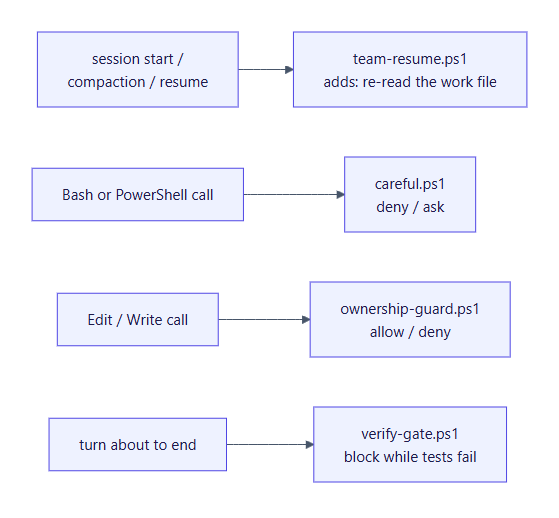
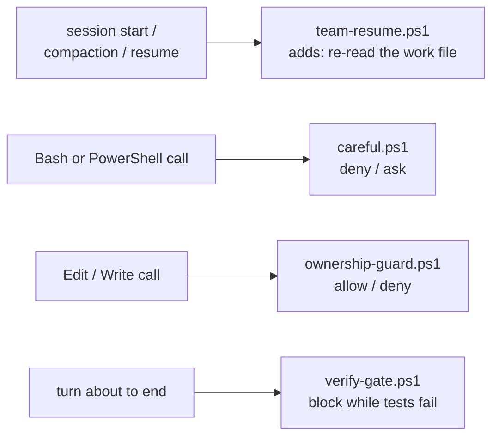

# Safety and evidence

A team of AI agents is only useful if you can trust its "PASS". This page covers the mechanisms that make a verdict mean something, and the four hooks that enforce rules instructions alone can't.

**Contents:**
- [Evidence rules](#evidence-rules)
- [The baseline](#the-baseline)
- [Fingerprints (is the evidence still fresh?)](#fingerprints-is-the-evidence-still-fresh)
- [The secret scan](#the-secret-scan)
- [The four hooks](#the-four-hooks)
- [What is still up to you](#what-is-still-up-to-you)

## Evidence rules

These run through every persona file and the skill:

- **Claims aren't evidence.** A report, commit message or code comment is a claim. The verifier and code-reviewer re-run commands themselves.
- **Negative claims need proof too.** "Not possible" or "pre-existing" needs a verbatim error, a doc citation or a run at the start commit.
- **Green means green.** Read the runner's passed, failed and skipped counts, never just the exit code:
  - zero tests executed is a FAIL;
  - a test that passed only on retry is FLAKY, not passing;
  - a passing subset is not a passing suite.
- **Tests must be able to fail.** test-engineer shows each new test failing on the code before the change. In the review, the testing lens reverts each fix in a scratch copy: if no test fails, the fix has no test behind it (MAJOR).
- **Nothing may lower the bar.** The final check flags:
  - new `@ts-ignore`, `eslint-disable`, `skip` or `.only`;
  - deleted or loosened assertions;
  - raised timeouts;
  - lowered thresholds.

  Each one needs a recorded reason.
- **Every finding is quoted.** Review findings quote the triggering line. "Safe" must cite the line that makes it safe, and "tested" must name the test.
- **Failures fail closed.** A reviewer or verifier report that errored, was cut off, or lacks its verdict, fingerprint or an AC result counts as **missing coverage**, never as approval.

## The baseline

Before any code changes, the verifier runs the full suite at the start commit and records **every failing test by name**. Later checks compare against that list:

- A test that fails at the end but not at the baseline is a **new failure**, caused by the run.
- A test that failed at the baseline and still fails is **pre-existing**. It's reported as "1 pre-existing failure, unchanged", never hidden as "all green" and never blamed on the run.

## Fingerprints (is the evidence still fresh?)

[`fingerprint.ps1`](../skills/team-build/scripts/fingerprint.ps1) prints a git tree hash of the files on disk, tracked and untracked, honouring `.gitignore`. It leaves out `docs/work/`, `.claude/agent-memory/` and `.claude/team/`, which change without changing the product. It builds the hash through a temporary index, so it never touches your real index.

- **Same content, same hash.** The hash is the same across commits, amends and rebases. A verdict recorded with a fingerprint is valid **exactly while the fingerprint still matches**.
- **Every verdict carries one.** Every verifier and code-reviewer report includes a `Fingerprint:` line. The verifier takes it at the start and at the end of its check; if they differ, the code changed while it was checking, and the verdict is FAIL.
- **Review and final check must match.** If they differ, code changed after review, so the changed part is re-reviewed and the final check is re-run.
- **Recomputed before Gate 2 and before deploy.** If it doesn't match the final check, the evidence is stale, and nothing is presented or deployed.

## The secret scan

[`secret-scan.ps1`](../skills/team-build/scripts/secret-scan.ps1) runs before **every** commit the team makes: checkpoints, gate records, verdicts and the retro. It scans only the **staged** diff and prints `file:line  kind`, **never the matched value**. It detects:

| Kind | Kind |
|---|---|
| Anthropic API key | Slack token |
| OpenAI-style API key | Stripe **live** secret or restricted key (`sk_live_`, `rk_live_`) |
| AWS access key id | Google API key |
| GitHub token | Private key block |
| GitLab token | Credentials in a **database or queue URL** (postgres, mysql, mongodb, redis, amqp) |
| JWT | Hardcoded secret assignment (`api_key = "..."` and similar) |
| A staged `.env` file (anything but `.env.example`) | |

It's pattern-based, so a secret in a format it doesn't know (an `https://user:pass@` URL, a Stripe test key, a custom token) isn't caught. It's a safety net, not a guarantee.

A hit blocks the commit. The file goes back to its owner, and you're told if a real secret may have been exposed. It will need rotating, because it stays in git history.

The coordinator always stages exact paths (`git add -- <path>`), never `git add -A`, so your own uncommitted files are never swept in.

**Fake keys in tests.** Test fixtures that need a fake key build it at runtime, so no key-shaped literal ever appears in the source. In the test runs the scan blocked four such literals, including one pasted into a persona's memory notes.

## The four hooks

Hooks are PowerShell scripts that Claude Code runs automatically at fixed points. `restore.ps1` wires them into `~/.claude/settings.json`. They apply to **every** session, but three of them do nothing unless a `/team-build` run or a `/freeze` is active.





### careful.ps1 (before every shell command)
Adapted from gstack's `/careful`. Commands are matched as text, so it is a safety net, not a security boundary.

| Decision | Commands |
|---|---|
| **Deny** | Recursive delete of a drive root or the home directory. Force-push to `main` or `master` as a single command (inside a chain of commands it asks instead). Stopping processes **by name** (`taskkill /IM`, `Stop-Process -Name`, `pkill`, `killall`). |
| **Ask** | Other recursive deletes (except build folders such as `node_modules` or `dist`). SQL `DROP`, `TRUNCATE`, or `DELETE` without `WHERE`. Database resets. `git reset --hard`, `git clean -f`, discarding all changes. Force-deleting a branch. Dropping stashes. `kubectl delete`. Docker container and volume removal. Disk formatting (`Format-Volume`, `diskpart`). Other force pushes. |
| **Ask** | Commands that would **print a secret into the transcript** (`gh auth token`, `printenv`, `cat .env`, cloud secret getters) unless the output is redirected or piped. |
| **Ask** | Obfuscated commands (IFS splitting, base64 piped to a shell, encoded PowerShell). |

Why deny killing processes by name? Stopping `node` by name would also kill Claude Code itself, and other people's tools. Every persona is told to note the PID of what it starts and stop only that PID.

### ownership-guard.ps1 (before every Edit or Write)
Two checks:
1. **Ownership (during `/team-build`).** Before each persona call, the coordinator writes `.claude/team/ownership.json`, listing which globs each persona may edit.
   - The hook **denies** a persona's edit outside its globs *before* it happens.
   - Each persona may always write its own `.claude/agent-memory/<persona>/`, but not another persona's.
   - The main session and non-team agents aren't restricted.
   - With no ownership file (no run in progress), everything is allowed.
2. **Freeze (any session).** After `/freeze src/auth tests/auth`, every session and subagent may edit only inside those folders, until `/freeze off`. Memory folders and the session scratchpad stay writable.

The hook can't see edits made through shell commands, so the coordinator's quick check also compares `git status` against ownership after every persona.

**When a hook itself fails:**

| Hook | Behaviour on failure |
|---|---|
| `ownership-guard` | An error while checking denies the edit (fails closed), because a crashed guard would otherwise let it through. If the tool payload can't be read at all, the edit is allowed. |
| `careful` | Asks you, instead of silently allowing the command |
| `team-resume` | Adds nothing |
| `verify-gate` | Lets the turn end |

### verify-gate.ps1 (when a turn is about to end)
While armed, the coordinator **can't end its turn while the unit tests fail**:
- **When:** it's armed after the builders' full check passes.
- **Which command:** the unit test command from `CLAUDE.md`.
- **Cap:** after 3 consecutive blocks it lets the turn end with a warning instead of looping.
- **Time limits:** the test command has 8 minutes, and the hook as a whole 10. A test suite slower than that counts as failing, so leave the gate unarmed on very slow suites.
- **Not with pre-existing failures:** it's never armed on a project whose baseline already has failing unit tests, because it can't tell old failures from new ones.

**The trust model.** The gate file (`.claude/team/verify-gate.json`) lives in the project, so a cloned repo could ship a malicious one. So:
- the gate runs a command only if `~/.claude/state/verify-gate-trust.json` maps this project to the SHA-256 of that exact command;
- only [`arm-gate.ps1`](../skills/team-build/scripts/arm-gate.ps1) writes both files.

A gate file that arrives with a clone, or is edited later, is ignored rather than executed.

```powershell
$gate = "$HOME/.claude/skills/team-build/scripts/arm-gate.ps1"
powershell -NoProfile -File $gate -Project "C:\path\to\project" -Command "npm test"  # arm and trust
powershell -NoProfile -File $gate -Project "C:\path\to\project" -Disarm              # pause (e.g. before stopping to ask you)
powershell -NoProfile -File $gate -Project "C:\path\to\project" -Rearm               # resume with the same trusted command
powershell -NoProfile -File $gate -Project "C:\path\to\project" -Remove              # remove the gate and its trust record
```

### team-resume.ps1 (session start, compaction and resume)
If `.claude/team/ownership.json` exists, a run is in progress. The hook adds a message to the session telling it to re-read `SKILL.md` and the work file (the Handoff, Decisions, Log and Verification) before doing anything, so a compacted or restarted session doesn't lose the current step, the approved gates or the fix-round tally. At a fresh start, the skill's preflight then offers to **resume or abandon**.

### Testing the hooks
[`hooks/tests/test-hooks.ps1`](../hooks/tests/test-hooks.ps1) pipes Claude-Code-style JSON payloads into each hook and checks the decisions: about 70 golden cases, including the secret scan and the trust model. It uses a throwaway project in `%TEMP%`, and restores any state files it touches. `restore.ps1` runs it at the end. Run it yourself after changing any hook or script:

```powershell
powershell -NoProfile -ExecutionPolicy Bypass -File "$HOME\.claude\hooks\tests\test-hooks.ps1"
# ... ends with: FAILURES: 0
```

## What is still up to you

The team marks anything it can't check itself as **UNVERIFIED**, and lists it separately at Gate 2 for a yes or no. Typical examples:
- hosting environment variables, DNS and OAuth redirect URLs;
- third-party dashboards, such as a spend limit in the Anthropic console;
- live model quality, when no API key was available or the paid eval wasn't approved;
- whether a backup restore has actually been tested.
