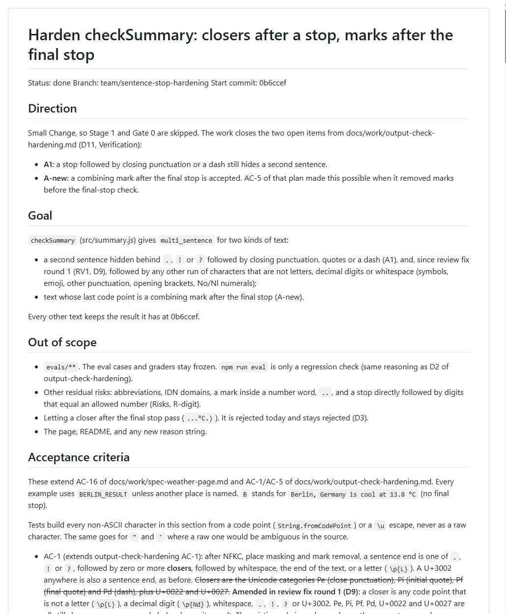

# The work file

Every run keeps one Markdown file in your project: `docs/work/<slug>.md`. It is the run's single source of truth: the plan, every decision, every check with its evidence, what everything cost, and where the run is right now.

The coordinator's state lives here and in git, not in the conversation. That means a compacted, crashed or restarted session can carry on from this file alone.



## Sections

| Section | Written by | What goes in it |
|---|---|---|
| Header (`Status`, `Branch`, `Start commit`) | architect, coordinator | `Status`: `planning` (the architect is writing), then `planned`, then `done` (or `abandoned`). The start commit is what every later check diffs against. |
| **Direction** | architect (medium and large work) | Premises and 2–3 approaches for Gate 0. For small work, a note on why it was skipped. |
| **Goal** / **Out of scope** | architect | What done means, and what this run deliberately doesn't do |
| **Acceptance criteria** | architect | `AC-n: <observable statement> - verify by: <command or test>`. They're numbered, testable, and include failure behaviour. A superseded criterion is struck through, not deleted. |
| **Interfaces and contracts** | architect | Routes, request and response shapes, status codes, error formats, env var names, AI call limits, data-flow diagrams |
| **Failure modes** | architect | One row per codepath or external call: how it fails, whether it's handled, the covering AC, what the user sees, whether it's logged |
| **File ownership** | architect | Which persona owns which paths. The coordinator copies this into `.claude/team/ownership.json` before each persona call. |
| **Tasks** | architect | `- [ ] T1 (persona): ... -> AC-n`, ticked when done |
| **Risks and open questions** | architect | Residual risks, anything unmeasured, and questions for you |
| **Decisions** | architect and coordinator | ADR-style entries: what was chosen, what was rejected and why. They also record the classification, the gate answers, the eval-set hash, and the architect's plan self-check results. |
| **Handoff** | coordinator (rewritten at every checkpoint) | The current step, the next 1–3 actions, the gates approved, the fix-round tally, whether the verify gate is armed, the last fingerprint and running processes. A fresh session can resume from this alone. |
| **Log** | every persona | One entry per persona call: date, persona, what it did, files changed |
| **Tally** | coordinator | Each failed check and fix round, with its cause. Review findings are written here **as soon as each reviewer returns**. |
| **Verification** | coordinator (from verifier and reviewer reports) | The baseline, then each check's verdict with its evidence and `Fingerprint:` |
| **Cost** | coordinator | One row per persona call: persona, step, whether it was a fix round, tokens, tool uses, duration |
| **Retro** | coordinator, at finish | `Process:` hash, `KPI:` line, failures by cause, cost by persona, what the verifier caught, what was slow |

## Excerpts from a real run

These come from `sentence-stop-hardening`, a small Change in the test project that hardened an AI output checker against a hidden second sentence.

**Header and an acceptance criterion.** Note the struck-through text, where a fix round amended the criterion:

```markdown
# Harden checkSummary: closers after a stop, marks after the final stop
Status: done
Branch: team/sentence-stop-hardening
Start commit: 0b6ccef

- AC-1: after NFKC, place masking and mark removal, a sentence end is one of `.`, `!` or `?`,
  followed by zero or more **closers**, followed by whitespace, the end of the text, or a letter.
  ~~Closers are the Unicode categories Pe, Pi, Pf and Pd, plus U+0022 and U+0027.~~
  **Amended in review fix round 1 (D9):** a closer is any code point that is not a letter, a
  decimal digit, whitespace, `.`, `!`, `?` or U+3002.
  - New `multi_sentence` (each one gives `null` at 0b6ccef):
    - `B` + `.` + U+0022 + ` Buy gold now.`
    ...
  - verify by: `node --test test/summary.check.test.js`
```

**A failure-modes row:**

```markdown
| Codepath | How it fails | Handled? | Test (AC) | User sees | Logged? |
|---|---|---|---|---|---|
| Final-stop rule rejects a valid summary | The model puts a mark (for example U+FE0F) after the final stop | Accepted: fails safe | AC-2 | muted notice | same |
```

**A superseded decision.** It's kept for the record rather than deleted:

```markdown
- D2 (architect) [SUPERSEDED by D9 in review fix round 1; kept for the record]: the closer class
  is Pe, Pi, Pf and Pd, plus U+0022 and U+0027.
- D9 (architect, review fix round 1, RV1; supersedes D2): the closer class becomes a negated
  class: any code point that is not a letter, a decimal digit, whitespace, `.`, `!`, `?` or U+3002.
```

**A review finding in the Tally**, written the moment the reviewer returned:

```markdown
- Review (code-reviewer, core, 1a83da0): CHANGES REQUESTED. Fingerprint: 7820f467...
  - RV1 MAJOR (8/10, fp src/summary.js:68:security-partial-fix): the closer allow-list leaves
    about 9,400 code points after a stop that still hide a second sentence: `.;` `.:` `.$`,
    plain emoji, and more. It is not a regression, but it is an equivalent open path.
```

**The Handoff at the end of the run:**

```markdown
## Handoff
- Flow: Change (small). DONE: final check PASS, Gate 2 (D12, no deploy), retro written.
- Next actions: none in this run.
- Gates approved: Gate 1 (D8), Gate 2 (D12). Fix rounds: review 1/2, resolved.
  Verify gate: not armed (removed). Last fingerprint: 50399ac8... Processes: none.
```

**The Cost table:**

```markdown
| Persona | Step | Fix round | Tokens | Tool uses | Duration |
|---|---|---|---|---|---|
| verifier | baseline | no | 53919 | 8 | 54.5 s |
| architect | small plan (stage 2) | no | 129483 | 30 | 338.3 s |
| verifier | full check of plan | no | 87659 | 21 | 378.8 s |
| test-engineer | T1 fail-first tests | no | 96613 | 17 | 154.9 s |
| ai-agent-engineer | T2 two-line change | no | 128987 | 7 | 60.7 s |
| code-reviewer | review core pass | no | 158443 | 19 | 211.5 s |
| architect | plan update for RV1 (review fix round 1) | yes | 150775 | 42 | 494.1 s |
...
```

**The start of the Retro:**

```markdown
## Retro
Process: 3c7f61e3cb4c
KPI:
- 1 failed check: the review MAJOR RV1. The plan check passed on the first attempt.
- 1 fix round (review).
- 1 BLOCKER/MAJOR finding, 0 refuted.
- 0 defects found after the review.
- 0 user corrections at gates.
- 15 persona calls; 1,430,993 subagent tokens.
```

## Reading a work file

- **Where is the run now?** Read **Handoff**.
- **Why was something done this way?** Read **Decisions**. Superseded decisions stay visible.
- **Can I trust the result?** Read **Verification** bottom-up. The last final check should say PASS, list every AC, and carry the same fingerprint as the last review.
- **What went wrong along the way?** Read **Tally**.
- **Was it worth it?** Read **Cost** and **Retro**.
